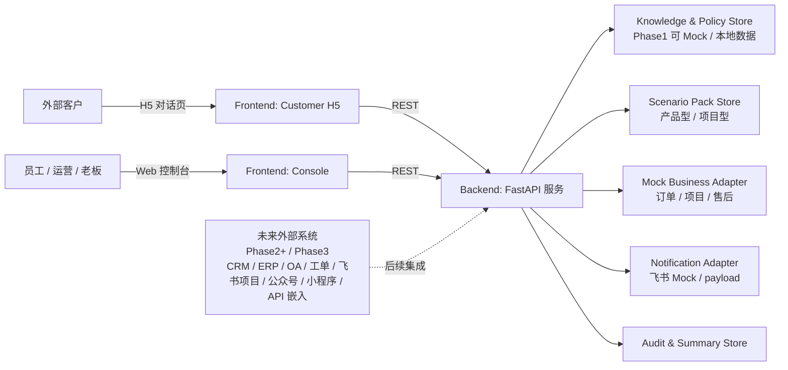
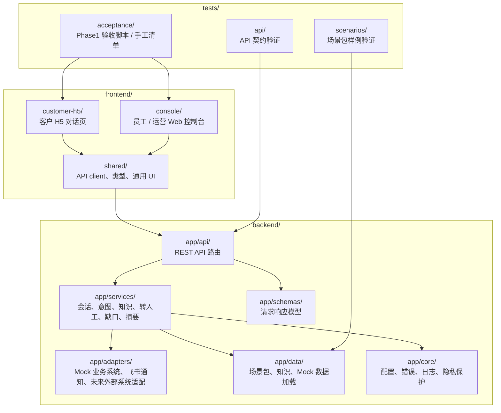
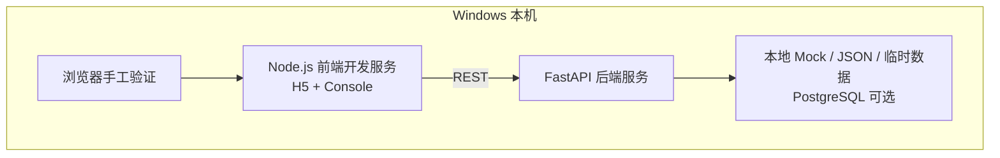
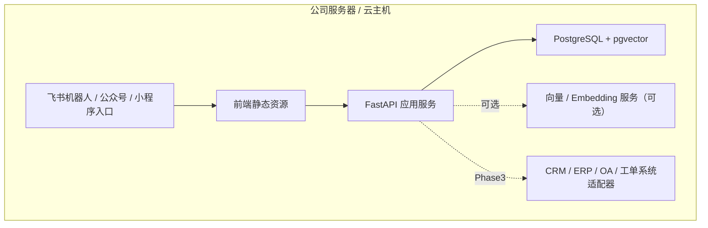

# 04 Architecture（系统架构设计）

## 0. 文档元信息

| 项 | 内容 |
|---|---|
| 上游输入 | `docs/02-srs.md`、`docs/03-prd.md` |
| 当前状态 | Phase1 已通过验收；Phase2 Conditional Go 待人工确认 |
| 最后更新 | 2026-07-09 |
| 当前阶段 | Phase1 本机 Demo |

## 1. 架构目标

Phase1 架构目标是用最少可控模块跑通数字客服 Demo 闭环，同时为后续真实集成和产品化保留边界。

- **前后端清晰分层**：H5 客户页、Web 控制台和后端服务通过 REST API 通信。
- **业务能力可替换**：知识、规则、场景包、Mock 数据和外部系统适配层独立，避免硬编码客户叙事。
- **安全默认保守**：外部 API、LLM、真实通知、真实业务系统接入默认关闭。
- **追溯闭环**：会话、意图、回答、缺口、转人工、通知和摘要均可追踪。
- **本机优先**：Demo 必须在本机可运行；Docker / PostgreSQL / pgvector 不可用时允许降级为 Mock / 临时数据。

## 2. 系统上下文图

## 3. 组件视图

| COMP-ID | 组件 | 职责 | 部署位置 | 通信方式 | 阶段 | 状态 | 覆盖 REQ |
|---|---|---|---|---|---|---|---|
| COMP-001 | Customer H5 | 客户对话、展示依据、Mock 标识、转人工状态 | 浏览器 | REST | [P1] | P1-已实现 | REQ-001、REQ-002 |
| COMP-002 | Web Console | 会话、缺口、待跟进、通知、摘要、场景包查看 | 浏览器 | REST | [P1] | P1-已实现 | REQ-010、REQ-011、REQ-012 |
| COMP-003 | API Layer | REST 路由、请求校验、统一错误码 | 本机 FastAPI | REST | [P1] | P1-已实现 | REQ-013、REQ-016 |
| COMP-004 | Conversation Service | 会话状态、消息记录、回复编排 | 后端服务层 | 内部调用 | [P1] | P1-已实现 | REQ-002、REQ-012 |
| COMP-005 | Intent Routing Service | 意图识别、流程路由、高风险判定 | 后端服务层 | 内部调用 | [P1] | P1-已实现（规则版） | REQ-003、REQ-005 |
| COMP-006 | Knowledge & Policy Service | 知识检索、规则匹配、依据返回 | 后端服务层 | 内部调用 | [P1] | P1-已实现（本地数据 / Mock） | REQ-004、REQ-005 |
| COMP-007 | Scenario Pack Service | 加载产品型 / 项目型场景包配置 | 后端服务层 | 内部调用 | [P1] | P1-已实现 | REQ-007、REQ-014 |
| COMP-008 | Business Adapter Layer | 订单 / 项目 / 售后进度查询 | 后端适配层 | 内部调用 | [P1] | P1-已实现（Mock） | REQ-008、REQ-014 |
| COMP-009 | Handoff Service | 转人工记录、负责人建议、状态更新 | 后端服务层 | 内部调用 | [P1] | P1-已实现 | REQ-006 |
| COMP-010 | Knowledge Gap Service | 缺口发现、确认、关闭 | 后端服务层 | 内部调用 | [P1] | P1-已实现 | REQ-011 |
| COMP-011 | Notification Adapter | 生成通知 payload、Mock 日志 | 后端适配层 | 内部调用 | [P1] | P1-已实现（默认不真实发送） | REQ-009 |
| COMP-012 | Summary & Audit Service | 日报摘要、审计日志、脱敏 | 后端服务层 | 内部调用 | [P1] | P1-已实现 | REQ-012、REQ-016 |

## 4. 模块划分

| MOD-ID | 模块 | 职责 | 输入 | 输出 | 边界 / 不负责 | 关联组件 | 关联设计 |
|---|---|---|---|---|---|---|---|
| MOD-001 | frontend/customer-h5 | 客户 H5 对话页 | 后端 API | 对话 UI | 不做员工侧 / 不做权限管理 | COMP-001 | `docs/design/h5-dialog.md`、`docs/design/frontend-interaction.md` |
| MOD-002 | frontend/console | 员工 / 运营 Web 控制台 | 后端 API | 运营 UI | 不做客户侧对话 | COMP-002 | `docs/design/web-console.md`、`docs/design/frontend-interaction.md` |
| MOD-003 | frontend/shared | API client、类型、通用 UI | — | 共享代码 | 不含业务逻辑 | COMP-001/002 | `docs/design/frontend-interaction.md` |
| MOD-004 | backend/app/api | REST API 路由 | HTTP 请求 | 统一响应 | 不含业务逻辑 | COMP-003 | `docs/07-api-spec.md` |
| MOD-005 | backend/app/services | 会话、意图、知识、转人工、缺口、摘要 | API 层调用 | 业务结果 | 不直接访问外部系统 | COMP-004~010/012 | `docs/design/backend-service.md` 等 |
| MOD-006 | backend/app/adapters | Mock 业务系统、飞书通知、未来外部系统适配 | 服务层调用 | 外部数据 / 通知 payload | 不含业务决策 | COMP-008/011 | `docs/design/mock-integrations.md` |
| MOD-007 | backend/app/data | 场景包、知识、Mock 数据加载 | 数据文件 | 内存数据 | 不含业务逻辑 | COMP-006/007/008 | `docs/design/scenario-packs.md` |
| MOD-008 | backend/app/schemas | 请求响应模型 | — | Pydantic 模型 | 不含业务逻辑 | COMP-003 | `docs/07-api-spec.md` |
| MOD-009 | backend/app/core | 配置、错误、日志、隐私保护 | — | 基础设施 | 不含业务逻辑 | 全部 | `docs/05-tech-spec.md` |
| MOD-010 | tests/api | API 契约验证 | 后端 API | 测试结果 | — | COMP-003 | `docs/09-verification.md` |
| MOD-011 | tests/scenarios | 场景包样例验证 | 数据 / 服务 | 测试结果 | — | COMP-007 | `docs/09-verification.md` |
| MOD-012 | tests/acceptance | Phase1 验收脚本 / 手工清单 | 前端 / 后端 | 验收结果 | — | COMP-001/002 | `docs/09-verification.md` |

## 5. 关键流程

### 5.1 客户问答流程（Flow-001）

- 触发：客户在 H5 发送问题。
- 主要步骤：
  1. H5 调用 `POST /api/v1/conversations` 创建会话。
  2. H5 调用 `POST /api/v1/conversations/{id}/messages` 发送问题。
  3. 后端记录消息并执行意图识别。
  4. 意图路由调用知识 / 规则 / Mock 业务适配层。
  5. 若有依据，返回回答、依据类型、来源 ID 和 Mock 标识。
- 成功结果：返回有依据的回答 + Mock 标识。
- 异常路径：API 错误返回统一错误码；消息持久化失败时记录并降级。
- 降级 / Mock 路径：无依据或高风险 → 创建转人工 / 知识缺口并返回兜底说明（见 Flow-003 / 004）。
- 权限拒绝路径：Phase1 无客户侧权限；高风险不自动承诺（见 Flow-004）。
- 外部服务不可用路径：Mock 业务适配层兜底（真实系统 Phase3 才接）。
- 关联 REQ / 功能：REQ-001~005、F-001/002/003。
- 关联 API / 数据 / TC：API-001/002、TC-001/003/004/005。

### 5.2 进度 Mock 查询流程（Flow-002）

- 触发：客户输入订单号 / 项目号 / 售后单号样例。
- 主要步骤：
  1. 用户输入订单号、项目号或售后单号样例。
  2. 意图路由识别为进度查询。
  3. Mock Business Adapter 查询本地 Mock 数据。
- 成功结果：返回阶段、状态、更新时间、下一步和 `mock: true` 标识。
- 异常路径：单号无匹配 → 提示无记录或转人工；不编造进度。
- 降级 / Mock 路径：Phase1 全程 Mock；真实业务系统 Phase3 接入。
- 权限拒绝路径：Phase1 无客户侧权限。
- 外部服务不可用路径：真实系统未接 → Mock 兜底，明确 `mock: true`。
- 关联 REQ / 功能：REQ-008、F-005。
- 关联 API / 数据 / TC：API-007、TC-008。

### 5.3 知识缺口流程（Flow-003）

- 触发：知识 / 规则服务无法找到依据或命中未知问题。
- 主要步骤：
  1. 知识 / 规则服务无法找到依据或命中未知问题。
  2. 系统创建 `KnowledgeGap`，记录问题摘要、场景包、建议标签和来源会话。
  3. 通知适配层生成 Mock 通知 payload。
  4. Web 控制台展示缺口，运营人员后续确认入库或关闭。
- 成功结果：缺口入库待确认，不向客户编造答案。
- 异常路径：缺口创建失败 → 记录错误并降级为转人工。
- 降级 / Mock 路径：通知为 Mock payload（Phase2 沙箱联调）。
- 权限拒绝路径：Phase1 控制台无复杂权限；缺口确认由运营人工。
- 外部服务不可用路径：通知适配层 Mock 兜底。
- 关联 REQ / 功能：REQ-011、F-008。
- 关联 API / 数据 / TC：API-005、TC-011。

### 5.4 转人工流程（Flow-004）

- 触发：命中高风险词、投诉、价格 / 交期承诺、合同或赔付相关意图。
- 主要步骤：
  1. 命中高风险词、投诉、价格 / 交期承诺、合同或赔付相关意图。
  2. 系统不自动承诺，创建 `HumanHandoff`。
  3. Web 控制台展示负责人建议和处理状态。
  4. 通知适配层记录 Mock 通知。
- 成功结果：高风险转人工，不向客户承诺。
- 异常路径：转人工创建失败 → 记录错误并提示客户稍后人工跟进。
- 降级 / Mock 路径：通知为 Mock payload。
- 权限拒绝路径：AI 不做售后高风险裁决；高风险必须转人工（ADR-0004）。
- 外部服务不可用路径：通知适配层 Mock 兜底。
- 关联 REQ / 功能：REQ-006、F-006。
- 关联 API / 数据 / TC：API-004、TC-006。

## 6. 运行拓扑

### 6.1 Phase1 本机拓扑

### 6.2 Phase2+ 候选拓扑

## 7. 架构决策

| ADR | 决策 | 状态 | 理由 |
|---|---|---|---|
| ADR-0001 | Phase1 客户侧入口采用 H5，不采用企业微信客户群自动回复。 | 已确认 | 客户群机器人自动对外回复前提已被证伪，H5 交付门槛低。 |
| ADR-0002 | Phase1 外部系统全部走 Mock 适配层。 | 已确认 | 避免真实凭据、生产数据和接口授权风险。 |
| ADR-0003 | 场景包以配置 / 数据表达，不硬编码客户叙事。 | 已确认 | 支持产品型与项目型客户复用。 |
| ADR-0004 | 不编造优先于演示顺滑。 | 已确认 | 保护售后、价格、交期、投诉等高风险边界。 |

## 8. REQ 到模块矩阵

| REQ-ID | Phase | COMP-ID | MOD-ID | Flow-ID | 详细设计 | 覆盖状态 |
|---|---|---|---|---|---|---|
| REQ-001 | P1 | COMP-001 | MOD-001 | Flow-001 | `docs/design/h5-dialog.md`、`docs/design/frontend-interaction.md` | 已覆盖 |
| REQ-002 | P1 | COMP-001/002/004 | MOD-001/002/005 | Flow-001 | `docs/design/backend-service.md` | 已覆盖 |
| REQ-003 | P1 | COMP-001/005 | MOD-001/005 | Flow-001 | `docs/design/backend-service.md` | 已覆盖 |
| REQ-004 | P1 | COMP-001/006 | MOD-001/005 | Flow-001 | `docs/design/knowledge-and-policy.md` | 已覆盖 |
| REQ-005 | P1 | COMP-001/002/006 | MOD-001/002/005 | Flow-001/004 | `docs/design/knowledge-and-policy.md` | 已覆盖 |
| REQ-006 | P1 | COMP-002/009 | MOD-002/005 | Flow-004 | `docs/design/web-console.md`、`docs/design/frontend-interaction.md` | 已覆盖 |
| REQ-007 | P1 | COMP-002/007 | MOD-002/005/007 | Flow-001 | `docs/design/scenario-packs.md` | 已覆盖 |
| REQ-008 | P1 | COMP-001/002/008 | MOD-001/002/006 | Flow-002 | `docs/design/mock-integrations.md`、`docs/design/frontend-interaction.md` | 已覆盖 |
| REQ-009 | P1 | COMP-002/011 | MOD-002/006 | Flow-003/004 | `docs/design/mock-integrations.md` | 已覆盖 |
| REQ-010 | P1 | COMP-002 | MOD-002 | — | `docs/design/web-console.md`、`docs/design/frontend-interaction.md` | 已覆盖 |
| REQ-011 | P1 | COMP-002/010 | MOD-002/005 | Flow-003 | `docs/design/knowledge-and-policy.md`、`docs/design/frontend-interaction.md` | 已覆盖 |
| REQ-012 | P1 | COMP-002/012 | MOD-002/005 | — | `docs/design/backend-service.md` | 已覆盖 |
| REQ-013 | P1 | COMP-001/002/003 | MOD-001/002/004 | Flow-001 | `docs/07-api-spec.md` | 已覆盖 |
| REQ-014 | P1 | COMP-001/002/007 | MOD-005/007 | Flow-001/002 | `docs/design/scenario-packs.md` | 已覆盖 |
| REQ-015 | P1 | 全部 | 全部 | — | `docs/05-tech-spec.md`、`docs/09-verification.md` | 已覆盖 |
| REQ-016 | P1 | 全部 | MOD-009 | — | `docs/05-tech-spec.md` | 已覆盖 |

## 9. 架构视图检查表

| 视图 | 必查项 | 通过标准 | 状态 |
|---|---|---|---|
| 系统上下文 | 用户、外部系统、核心服务、边界 | 明确哪些外部系统是真实、Mock、候选或默认关闭 | 通过（§2 `future_systems` 标注状态） |
| 组件 / 容器 | 前端、后端、数据、适配层、测试入口 | 每个组件有 COMP-ID、职责、部署、通信、阶段、状态、REQ | 通过（§3 COMP-001~012） |
| 模块 | 模块职责、边界、关联组件 / 设计 | 每个模块有 MOD-ID + 边界 | 通过（§4 MOD-001~012） |
| 关键流程 | 主流程、异常、降级、权限拒绝 | 流程有 Flow-ID + 关联 API / TC | 通过（§5 Flow-001~004） |
| 运行拓扑 | 本机、服务器、Docker、外部服务 | 明确端口、资源、持久化、降级 | 通过（§6） |
| ADR / 决策 | 关键技术 / 交付 / 安全决策 | 有状态、理由 | 通过（§7 ADR-0001~0004；备选 / 取舍待 P2 补） |
| 追溯 | REQ → COMP / MOD / Flow | 矩阵完整 | 通过（§8） |

## 10. 待人工确认项

> 04 相关待确认项集中在 `docs/research/2026-07-09-docs-open-items.md`：

| 引用 ID | 待确认项 | 当前状态 |
|---|---|---|
| DOC-C-003 | 飞书通知是否进入沙箱 / 试点评估 | 已确认（Phase2 技术验证任务） |
| DOC-C-004 | PostgreSQL / pgvector 是否作为 Phase2 必做项 | 已确认（先技术验证，不作前置） |
| IN-C-005 | Channel Adapter Layer 设计 | 暂缓（Phase2 readiness gate） |
| ARCH-C-001 | 04/05 doc-standards 合规改进（本次 P1 执行） | 进行中（PR-2） |

> Phase1 已确认项：Docker 不强制、React + Vite + TypeScript、飞书 Mock、不编造（详见 `ai/project-rules.md` §1、`docs/05-tech-spec.md`）。未来真实业务系统适配（权限 / 审计 / 重试 / 脱敏）Phase3 启动前补 `docs/design/`。
