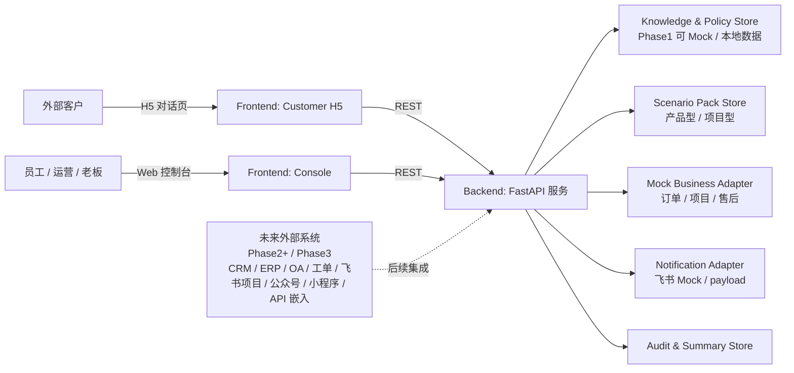
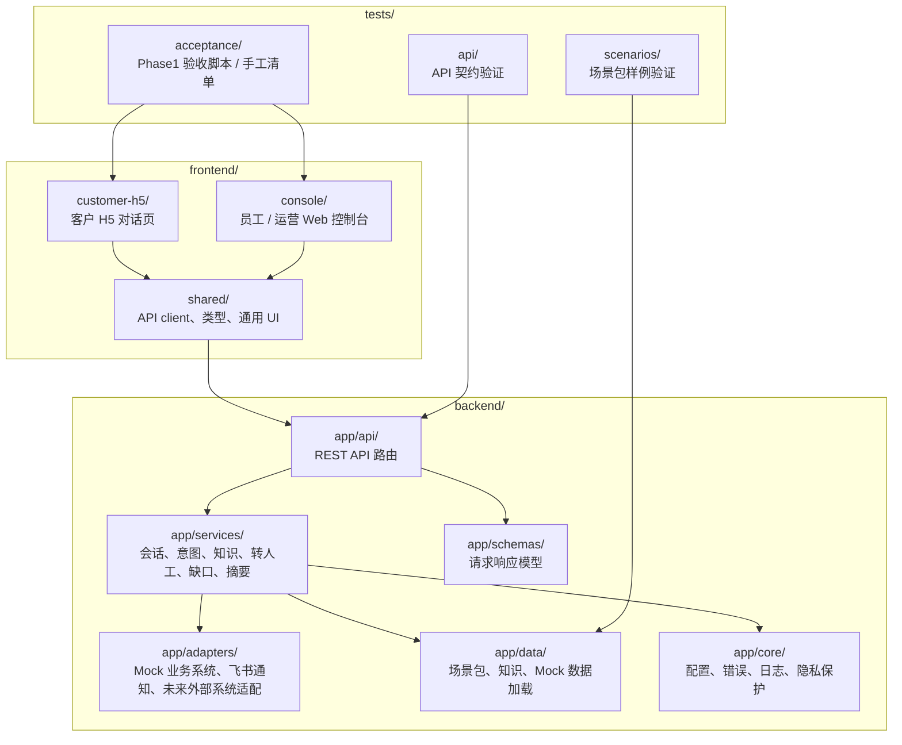
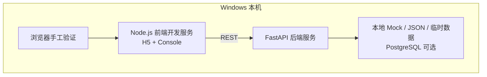
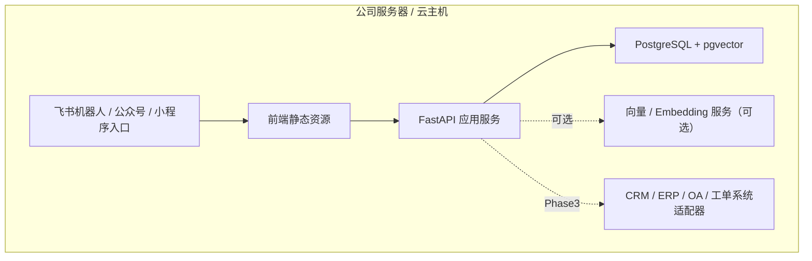

# 04 Architecture（系统架构设计）

## 0. 文档元信息

| 项 | 内容 |
|---|---|
| 上游输入 | `docs/02-srs.md`、`docs/03-prd.md` |
| 当前状态 | Phase1 已通过验收；Phase2 Conditional Go 待人工确认 |
| 最后更新 | 2026-07-09 |
| 当前阶段 | Phase1 本机 Demo |

## 1. 架构目标

Phase1 架构目标是用最少可控模块跑通数字客服 Demo 闭环，同时为后续真实集成和产品化保留边界。

- **前后端清晰分层**：H5 客户页、Web 控制台和后端服务通过 REST API 通信。
- **业务能力可替换**：知识、规则、场景包、Mock 数据和外部系统适配层独立，避免硬编码客户叙事。
- **安全默认保守**：外部 API、LLM、真实通知、真实业务系统接入默认关闭。
- **追溯闭环**：会话、意图、回答、缺口、转人工、通知和摘要均可追踪。
- **本机优先**：Demo 必须在本机可运行；Docker / PostgreSQL / pgvector 不可用时允许降级为 Mock / 临时数据。

## 2. 系统上下文图

## 3. 组件视图

| 组件 | 职责 | Phase1 实现口径 | 覆盖 REQ |
|---|---|---|---|
| Customer H5 | 客户对话、展示依据、Mock 标识、转人工状态 | 独立 Web 页面 | REQ-001、REQ-002 |
| Web Console | 会话、缺口、待跟进、通知、摘要、场景包查看 | 独立 Web 控制台 | REQ-010、REQ-011、REQ-012 |
| API Layer | REST 路由、请求校验、统一错误码 | FastAPI | REQ-013、REQ-016 |
| Conversation Service | 会话状态、消息记录、回复编排 | 服务层 | REQ-002、REQ-012 |
| Intent Routing Service | 意图识别、流程路由、高风险判定 | 规则版 | REQ-003、REQ-005 |
| Knowledge & Policy Service | 知识检索、规则匹配、依据返回 | 本地数据 / Mock | REQ-004、REQ-005 |
| Scenario Pack Service | 加载产品型 / 项目型场景包配置 | 配置 / 数据文件 | REQ-007、REQ-014 |
| Business Adapter Layer | 订单 / 项目 / 售后进度查询 | Mock 适配 | REQ-008、REQ-014 |
| Handoff Service | 转人工记录、负责人建议、状态更新 | 本地状态 | REQ-006 |
| Knowledge Gap Service | 缺口发现、确认、关闭 | 本地状态 | REQ-011 |
| Notification Adapter | 生成通知 payload、Mock 日志 | 默认不真实发送 | REQ-009 |
| Summary & Audit Service | 日报摘要、审计日志、脱敏 | 本地状态 | REQ-012、REQ-016 |

## 4. 模块划分

## 5. 关键流程

### 5.1 客户问答流程

1. H5 调用 `POST /api/v1/conversations` 创建会话。
2. H5 调用 `POST /api/v1/conversations/{id}/messages` 发送问题。
3. 后端记录消息并执行意图识别。
4. 意图路由调用知识 / 规则 / Mock 业务适配层。
5. 若有依据，返回回答、依据类型、来源 ID 和 Mock 标识。
6. 若无依据或高风险，创建转人工 / 知识缺口并返回兜底说明。

### 5.2 进度 Mock 查询流程

1. 用户输入订单号、项目号或售后单号样例。
2. 意图路由识别为进度查询。
3. Mock Business Adapter 查询本地 Mock 数据。
4. 返回阶段、状态、更新时间、下一步和 `mock: true` 标识。

### 5.3 知识缺口流程

1. 知识 / 规则服务无法找到依据或命中未知问题。
2. 系统创建 `KnowledgeGap`，记录问题摘要、场景包、建议标签和来源会话。
3. 通知适配层生成 Mock 通知 payload。
4. Web 控制台展示缺口，运营人员后续确认入库或关闭。

### 5.4 转人工流程

1. 命中高风险词、投诉、价格 / 交期承诺、合同或赔付相关意图。
2. 系统不自动承诺，创建 `HumanHandoff`。
3. Web 控制台展示负责人建议和处理状态。
4. 通知适配层记录 Mock 通知。

## 6. 运行拓扑

### 6.1 Phase1 本机拓扑

### 6.2 Phase2+ 候选拓扑

## 7. 架构决策

| ADR | 决策 | 状态 | 理由 |
|---|---|---|---|
| ADR-0001 | Phase1 客户侧入口采用 H5，不采用企业微信客户群自动回复。 | 已确认 | 客户群机器人自动对外回复前提已被证伪，H5 交付门槛低。 |
| ADR-0002 | Phase1 外部系统全部走 Mock 适配层。 | 已确认 | 避免真实凭据、生产数据和接口授权风险。 |
| ADR-0003 | 场景包以配置 / 数据表达，不硬编码客户叙事。 | 已确认 | 支持产品型与项目型客户复用。 |
| ADR-0004 | 不编造优先于演示顺滑。 | 已确认 | 保护售后、价格、交期、投诉等高风险边界。 |

## 8. REQ 到模块矩阵

| REQ-ID | 前端 | 后端服务 | 数据 / 适配 | 设计文档 |
|---|---|---|---|---|
| REQ-001 | Customer H5 | API Layer | Conversation | `docs/design/h5-dialog.md`、`docs/design/frontend-interaction.md` |
| REQ-002 | Customer H5 / Console | Conversation Service | Conversation Store | `docs/design/backend-service.md` |
| REQ-003 | Customer H5 | Intent Routing Service | Scenario Pack | `docs/design/backend-service.md` |
| REQ-004 | Customer H5 | Knowledge & Policy Service | Knowledge Store | `docs/design/knowledge-and-policy.md` |
| REQ-005 | Customer H5 / Console | Safety Policy | Audit Store | `docs/design/knowledge-and-policy.md` |
| REQ-006 | Console | Handoff Service | HumanHandoff | `docs/design/web-console.md`、`docs/design/frontend-interaction.md` |
| REQ-007 | Console | Scenario Pack Service | ScenarioPack | `docs/design/scenario-packs.md` |
| REQ-008 | Customer H5 / Console | Business Adapter | MockBusinessRecord | `docs/design/mock-integrations.md`、`docs/design/frontend-interaction.md` |
| REQ-009 | Console | Notification Adapter | Notification | `docs/design/mock-integrations.md` |
| REQ-010 | Console | Aggregation APIs | 多对象 | `docs/design/web-console.md`、`docs/design/frontend-interaction.md` |
| REQ-011 | Console | Knowledge Gap Service | KnowledgeGap | `docs/design/knowledge-and-policy.md`、`docs/design/frontend-interaction.md` |
| REQ-012 | Console | Summary & Audit Service | DailySummary / AuditLog | `docs/design/backend-service.md` |
| REQ-013 | H5 / Console | API Layer | 全部 | `docs/07-api-spec.md` |
| REQ-014 | H5 / Console | Config Loader | ScenarioPack / Mock 数据 | `docs/design/scenario-packs.md` |
| REQ-015 | 全部 | 全部 | 本机环境 | `docs/05-tech-spec.md`、`docs/09-verification.md` |
| REQ-016 | 全部 | Core Security | AuditLog | `docs/05-tech-spec.md` |

## 9. 风险与延后确认

- Docker 当前不可用；Phase1 已确认不强制 PostgreSQL + pgvector，优先走 Mock / 本地临时数据降级。
- React + Vite + TypeScript 已确认为 Phase1 前端技术栈。
- 飞书真实通知默认不允许，Phase1 仅 Mock payload；真实联网和凭据配置延后到 Phase2+ 单独确认。
- 未来真实业务系统适配需单独设计权限、审计、错误重试和数据脱敏。
