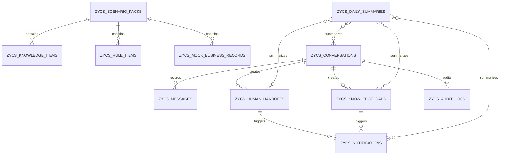

# 06 DB Design（数据库设计）

## 0. 文档元信息

| 项 | 内容 |
|---|---|
| 保留 / 省略决策 | 保留；项目有持久化存储计划 |
| 上游输入 | `docs/02-srs.md`、`docs/05-tech-spec.md` |
| 当前状态 | Phase1 已通过验收；Phase2 Conditional Go 待人工确认 |
| 最后更新 | 2026-07-09 |
| 当前阶段 | Phase1 可降级为 Mock / 本地临时数据 |

## 1. 设计原则

- 数据库目标方案为 PostgreSQL + pgvector；Phase1 若 Docker / DB 不可用，可先使用 JSON / SQLite / 内存 Mock。
- 表名前缀使用已确认的 `zycs_`。
- 不存真实客户隐私、真实联系方式、真实订单、真实合同或生产会话。
- 所有 Mock 数据必须有 `is_mock` 或来源标识。
- 未来真实业务系统数据只保存必要摘要和引用 ID，不复制敏感原始数据。

## 2. 概念模型

## 3. 表清单

| 表 | 说明 | Phase | 覆盖 REQ |
|---|---|---|---|
| `zycs_scenario_packs` | 产品型 / 项目型场景包 | P1 | REQ-007、REQ-014 |
| `zycs_conversations` | 客户会话 | P1 | REQ-001、REQ-002 |
| `zycs_messages` | 会话消息与回复 | P1 | REQ-002、REQ-004 |
| `zycs_knowledge_items` | 知识条目 | P1 | REQ-004、REQ-005 |
| `zycs_rule_items` | 规则条目 / 高风险规则 | P1 | REQ-003、REQ-005 |
| `zycs_mock_business_records` | Mock 订单 / 项目 / 售后记录 | P1 | REQ-008、REQ-014 |
| `zycs_human_handoffs` | 转人工记录 | P1 | REQ-006、REQ-009 |
| `zycs_knowledge_gaps` | 知识缺口 | P1 | REQ-011 |
| `zycs_notifications` | 通知 payload 与发送状态 | P1 Mock / P2 | REQ-009 |
| `zycs_daily_summaries` | 日报摘要 | P1 | REQ-012 |
| `zycs_audit_logs` | 审计日志 | P1 | REQ-012、REQ-016 |

## 4. 表结构草案

### 4.1 `zycs_scenario_packs`

| 字段 | 类型 | 说明 |
|---|---|---|
| `id` | uuid / text | 场景包 ID |
| `code` | text | `product_business` / `project_business` |
| `name` | text | 场景包名称 |
| `description` | text | 说明 |
| `status` | text | `draft` / `active` / `archived` |
| `source_ref` | text | 来源文档锚点 |
| `is_mock` | boolean | 是否 Mock / 样例 |
| `created_at` | timestamp | 创建时间 |
| `updated_at` | timestamp | 更新时间 |

### 4.2 `zycs_conversations`

| 字段 | 类型 | 说明 |
|---|---|---|
| `id` | uuid / text | 会话 ID |
| `channel` | text | `h5` / future channels |
| `scenario_pack_id` | uuid / text | 场景包 ID |
| `customer_alias` | text | Demo 匿名客户标识 |
| `status` | text | `open` / `handoff` / `closed` |
| `risk_level` | text | `low` / `medium` / `high` |
| `is_mock` | boolean | Demo 数据标识 |
| `created_at` | timestamp | 创建时间 |
| `updated_at` | timestamp | 更新时间 |

### 4.3 `zycs_messages`

| 字段 | 类型 | 说明 |
|---|---|---|
| `id` | uuid / text | 消息 ID |
| `conversation_id` | uuid / text | 会话 ID |
| `sender_type` | text | `customer` / `assistant` / `staff` / `system` |
| `content` | text | 脱敏后的消息内容 |
| `intent` | text | 意图结果 |
| `answer_type` | text | `knowledge` / `rule` / `mock_business` / `handoff` / `gap` |
| `source_ref` | text | 知识 / 规则 / Mock 来源 |
| `is_mock` | boolean | 是否 Mock |
| `created_at` | timestamp | 创建时间 |

### 4.4 `zycs_knowledge_items`

| 字段 | 类型 | 说明 |
|---|---|---|
| `id` | uuid / text | 知识 ID |
| `scenario_pack_id` | uuid / text | 场景包 ID |
| `title` | text | 标题 |
| `content` | text | 知识正文 |
| `tags` | jsonb / text | 标签 |
| `source_ref` | text | 来源锚点 |
| `status` | text | `draft` / `active` / `archived` |
| `embedding` | vector / nullable | 向量，Phase1 可为空 |
| `is_mock` | boolean | 是否样例 |
| `updated_at` | timestamp | 更新时间 |

### 4.5 `zycs_rule_items`

| 字段 | 类型 | 说明 |
|---|---|---|
| `id` | uuid / text | 规则 ID |
| `scenario_pack_id` | uuid / text | 场景包 ID，可为空表示全局 |
| `rule_type` | text | `intent` / `risk` / `handoff` / `policy` |
| `pattern` | text / jsonb | 关键词或规则配置 |
| `action` | text | `answer` / `handoff` / `gap` / `mock_lookup` |
| `response_template` | text | 回复模板 |
| `priority` | integer | 优先级 |
| `source_ref` | text | 来源锚点 |
| `enabled` | boolean | 是否启用 |

### 4.6 `zycs_mock_business_records`

| 字段 | 类型 | 说明 |
|---|---|---|
| `id` | uuid / text | 记录 ID |
| `scenario_pack_id` | uuid / text | 场景包 ID |
| `record_type` | text | `order` / `project` / `ticket` |
| `external_ref` | text | Mock 编号 |
| `status` | text | 当前状态 |
| `summary` | text | 摘要 |
| `next_step` | text | 下一步 |
| `eta` | text / date | 预计时间，Mock |
| `payload` | jsonb / text | 扩展信息 |
| `is_mock` | boolean | 必须为 true |
| `updated_at` | timestamp | 更新时间 |

### 4.7 `zycs_human_handoffs`

| 字段 | 类型 | 说明 |
|---|---|---|
| `id` | uuid / text | 转人工 ID |
| `conversation_id` | uuid / text | 会话 ID |
| `reason` | text | 转人工原因 |
| `risk_level` | text | 风险等级 |
| `suggested_owner` | text | 建议负责人角色 |
| `status` | text | `open` / `processing` / `closed` |
| `source_message_id` | uuid / text | 来源消息 |
| `created_at` | timestamp | 创建时间 |
| `updated_at` | timestamp | 更新时间 |

### 4.8 `zycs_knowledge_gaps`

| 字段 | 类型 | 说明 |
|---|---|---|
| `id` | uuid / text | 缺口 ID |
| `conversation_id` | uuid / text | 会话 ID |
| `question` | text | 脱敏后的问题 |
| `suggested_tags` | jsonb / text | 建议标签 |
| `status` | text | `new` / `reviewing` / `accepted` / `rejected` / `closed` |
| `resolution_note` | text | 处理说明 |
| `created_at` | timestamp | 创建时间 |
| `updated_at` | timestamp | 更新时间 |

### 4.9 `zycs_notifications`

| 字段 | 类型 | 说明 |
|---|---|---|
| `id` | uuid / text | 通知 ID |
| `target_type` | text | `feishu` / `console` / `log` |
| `event_type` | text | `handoff` / `knowledge_gap` / `summary` |
| `related_id` | uuid / text | 关联对象 ID |
| `payload` | jsonb / text | 通知内容，禁止真实 token |
| `send_status` | text | `mocked` / `pending` / `sent` / `failed` |
| `is_mock` | boolean | Phase1 默认 true |
| `created_at` | timestamp | 创建时间 |

### 4.10 `zycs_daily_summaries`

| 字段 | 类型 | 说明 |
|---|---|---|
| `id` | uuid / text | 摘要 ID |
| `summary_date` | date | 日期 |
| `scenario_pack_id` | uuid / text | 场景包 ID，可为空 |
| `conversation_count` | integer | 会话数 |
| `handoff_count` | integer | 转人工数 |
| `gap_count` | integer | 缺口数 |
| `open_item_count` | integer | 未结案数 |
| `content` | text | 摘要文本 |
| `created_at` | timestamp | 创建时间 |

### 4.11 `zycs_audit_logs`

| 字段 | 类型 | 说明 |
|---|---|---|
| `id` | uuid / text | 日志 ID |
| `request_id` | text | 请求 ID |
| `actor_type` | text | `customer` / `staff` / `system` |
| `action` | text | 动作 |
| `resource_type` | text | 资源类型 |
| `resource_id` | text | 资源 ID |
| `safe_detail` | jsonb / text | 脱敏详情 |
| `created_at` | timestamp | 创建时间 |

## 5. 索引与约束

- `zycs_conversations(status, updated_at)`：控制台列表。
- `zycs_messages(conversation_id, created_at)`：会话消息流。
- `zycs_knowledge_items(scenario_pack_id, status)`：知识检索范围。
- `zycs_rule_items(rule_type, enabled, priority)`：规则匹配。
- `zycs_mock_business_records(record_type, external_ref)`：Mock 查询。
- `zycs_human_handoffs(status, risk_level, updated_at)`：待跟进列表。
- `zycs_knowledge_gaps(status, updated_at)`：缺口处理列表。
- `zycs_notifications(event_type, send_status, created_at)`：通知追踪。

## 6. 迁移与种子数据

Phase1 种子数据至少包含：

- 产品型场景包：灯饰参数咨询、定制询盘、售后规则、订单进度 Mock。
- 项目型场景包：方案开发流程、项目里程碑、技术资料、售后工单、项目进度 Mock。
- 高风险规则：投诉、赔付、合同、价格、交期承诺、隐私数据。
- Mock 通知模板：转人工、知识缺口、日报摘要。

## 7. 安全与留存

- Demo 数据仅用于本地演示，不得混入真实客户数据。
- 日志只保存脱敏后的动作和资源 ID。
- 后续若接入真实系统，需补充数据留存期限、删除策略、权限模型和审计报告。

## 8. REQ 到表追溯

| REQ-ID | 表 |
|---|---|
| REQ-001 | `zycs_conversations`、`zycs_messages` |
| REQ-002 | `zycs_conversations`、`zycs_messages` |
| REQ-003 | `zycs_rule_items`、`zycs_messages` |
| REQ-004 | `zycs_knowledge_items`、`zycs_rule_items`、`zycs_messages` |
| REQ-005 | `zycs_rule_items`、`zycs_human_handoffs`、`zycs_audit_logs` |
| REQ-006 | `zycs_human_handoffs`、`zycs_notifications` |
| REQ-007 | `zycs_scenario_packs` |
| REQ-008 | `zycs_mock_business_records` |
| REQ-009 | `zycs_notifications` |
| REQ-010 | `zycs_conversations`、`zycs_human_handoffs`、`zycs_knowledge_gaps`、`zycs_daily_summaries` |
| REQ-011 | `zycs_knowledge_gaps`、`zycs_knowledge_items` |
| REQ-012 | `zycs_daily_summaries`、`zycs_audit_logs` |
| REQ-013 | 全部业务表 |
| REQ-014 | `zycs_scenario_packs`、`zycs_mock_business_records` |
| REQ-015 | 不适用，运行与验证需求 |
| REQ-016 | `zycs_audit_logs`、全部含 `is_mock` 的表 |

## 9. 人工确认记录

1. 表前缀已确认为 `zycs_`。
2. Phase1 已确认不强制使用 PostgreSQL，开发计划可先用 JSON / SQLite / 内存实现。
3. Phase1 已确认不强制引入 pgvector，默认使用关键词 / 规则匹配降级。
