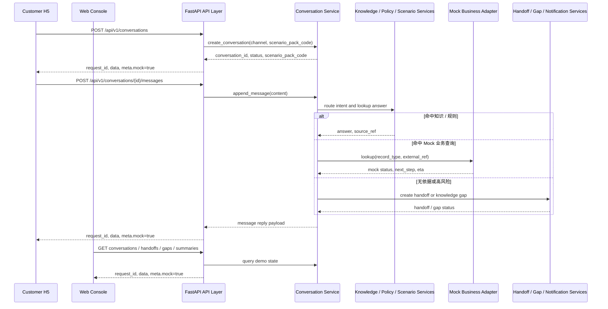

# 07 API Spec（接口设计）

## 0. 文档元信息

| 项 | 内容 |
|---|---|
| 保留 / 省略决策 | 保留；项目包含 H5 / Web / 通知接口 |
| 上游输入 | `docs/02-srs.md`、`docs/04-architecture.md`、`docs/06-db-design.md` |
| 当前状态 | Phase1 已通过验收；Phase2 Conditional Go 待人工确认 |
| 最后更新 | 2026-07-09 |
| API 前缀 | `/api/v1` |

## 1. 统一约定

### 1.1 响应结构

```json
{
  "request_id": "req_demo_001",
  "data": {},
  "meta": {
    "mock": true
  }
}
```

### 1.2 错误结构

```json
{
  "request_id": "req_demo_001",
  "error": {
    "code": "VALIDATION_ERROR",
    "message": "请求参数不合法",
    "details": {}
  }
}
```

### 1.3 安全约定

- Phase1 本机 Demo 不设计生产鉴权；不得因此接入真实数据。
- 所有 Mock 响应必须包含 `mock: true` 或字段级 Mock 标识。
- 外部通知默认不真实发送，只返回 payload 与 `send_status: mocked`。

## 2. 接口清单

| API-ID | 方法 | 路径 | 说明 | 覆盖 REQ |
|---|---|---|---|---|
| API-001 | POST | `/conversations` | 创建客户会话 | REQ-001、REQ-002 |
| API-002 | POST | `/conversations/{conversation_id}/messages` | 发送消息并获取回复 | REQ-001~REQ-005 |
| API-003 | GET | `/conversations` | 控制台查询会话列表 | REQ-002、REQ-010 |
| API-004 | GET / PATCH | `/handoffs`、`/handoffs/{handoff_id}` | 查询 / 更新转人工 | REQ-006、REQ-010 |
| API-005 | GET / PATCH | `/knowledge-gaps`、`/knowledge-gaps/{gap_id}` | 查询 / 更新知识缺口 | REQ-011 |
| API-006 | GET / POST | `/knowledge-items` | 查询 / 新增知识候选 | REQ-004、REQ-011 |
| API-007 | GET | `/mock-business/{record_type}/{external_ref}` | Mock 订单 / 项目 / 售后查询 | REQ-008 |
| API-008 | GET | `/mock-business` | 控制台查看 Mock 数据 | REQ-008、REQ-014 |
| API-009 | POST / GET | `/notifications/mock`、`/notifications` | 生成 / 查看 Mock 通知 | REQ-009 |
| API-010 | GET | `/scenario-packs` | 查询场景包列表 | REQ-007 |
| API-011 | GET | `/scenario-packs/{scenario_pack_id}` | 查询场景包详情 | REQ-007、REQ-014 |
| API-012 | GET | `/summaries/daily` | 查询日报摘要 | REQ-012 |

## 3. 接口交互图



## 4. 接口契约草案

### API-001 创建会话

`POST /api/v1/conversations`

请求：

```json
{
  "channel": "h5",
  "scenario_pack_code": "product_business",
  "customer_alias": "demo_customer"
}
```

响应：

```json
{
  "request_id": "req_001",
  "data": {
    "conversation_id": "conv_001",
    "status": "open",
    "scenario_pack_code": "product_business"
  },
  "meta": { "mock": true }
}
```

### API-002 发送消息

`POST /api/v1/conversations/{conversation_id}/messages`

请求：

```json
{
  "content": "我想查一下 HC-ORDER-001 的生产进度"
}
```

响应：

```json
{
  "request_id": "req_002",
  "data": {
    "message_id": "msg_002",
    "intent": "order_progress",
    "answer_type": "mock_business",
    "answer": "这是 Mock 订单进度：当前处于生产排期，下一步为质检。",
    "source_ref": "mock_business:HC-ORDER-001",
    "handoff": null,
    "knowledge_gap": null
  },
  "meta": { "mock": true }
}
```

无依据或高风险响应示例：

```json
{
  "request_id": "req_003",
  "data": {
    "message_id": "msg_003",
    "intent": "high_risk_complaint",
    "answer_type": "handoff",
    "answer": "这个问题需要人工确认，我已为你记录并转给对应人员跟进。",
    "source_ref": "rule:high_risk_handoff",
    "handoff": {
      "handoff_id": "handoff_001",
      "status": "open",
      "reason": "high_risk_complaint"
    },
    "knowledge_gap": null
  },
  "meta": { "mock": true }
}
```

### API-003 查询会话列表

`GET /api/v1/conversations?status=open&scenario_pack_code=product_business`

响应字段：`conversation_id`、`channel`、`scenario_pack_code`、`status`、`risk_level`、`last_message`、`updated_at`、`mock`。

### API-004 查询 / 更新转人工

`GET /api/v1/handoffs?status=open`

`PATCH /api/v1/handoffs/{handoff_id}`

更新请求：

```json
{
  "status": "processing",
  "resolution_note": "已分配给售后同事跟进"
}
```

### API-005 查询 / 更新知识缺口

`GET /api/v1/knowledge-gaps?status=new`

`PATCH /api/v1/knowledge-gaps/{gap_id}`

更新请求：

```json
{
  "status": "reviewing",
  "resolution_note": "等待业务确认答案"
}
```

### API-006 知识条目

`GET /api/v1/knowledge-items?scenario_pack_code=project_business`

`POST /api/v1/knowledge-items`

新增请求：

```json
{
  "scenario_pack_code": "project_business",
  "title": "项目开发阶段说明",
  "content": "Mock 知识内容，仅用于 Demo。",
  "source_ref": "SRC-SP-PROJECT-001",
  "status": "draft"
}
```

### API-007 Mock 业务查询

`GET /api/v1/mock-business/order/DEMO-ORDER-202607-001`

响应字段：`record_type`、`external_ref`、`scenario_pack_code`、`status`、`summary`、`next_step`、`eta`、`source_ref`、`source_system`、`environment`、`stage`、`payload`、`mock`。

Demo Sandbox 标准模拟数据要求：`environment=demo_sandbox`、`mock=true`；`payload.schema_version=demo_sandbox.v1`；`payload` 内保留 `customer`、`business_object`、`progress_nodes`、`allowed_display_fields`、`redaction_applied` 等字段，供 LLM Sandbox 后续作为证据输入。

### API-008 Mock 数据列表

`GET /api/v1/mock-business?record_type=project&scenario_pack_code=project_business`

用于控制台查看样例数据。Phase2 / Demo Sandbox 保留旧 `HC-*` / `XS-*` 编号兼容，同时新增 `DEMO-*` 标准模拟编号。

### API-009 Mock 通知

`POST /api/v1/notifications/mock`

请求：

```json
{
  "event_type": "handoff",
  "related_id": "handoff_001",
  "target_type": "feishu"
}
```

响应字段：`notification_id`、`payload`、`send_status: mocked`、`mock: true`。

### API-010 场景包列表

`GET /api/v1/scenario-packs`

返回产品型和项目型场景包的基本信息。

### API-011 场景包详情

`GET /api/v1/scenario-packs/{scenario_pack_id}`

返回场景包配置摘要、知识数量、规则数量和 Mock 数据数量。

### API-012 日报摘要

`GET /api/v1/summaries/daily?date=2026-07-03`

响应字段：`summary_date`、`conversation_count`、`handoff_count`、`gap_count`、`open_item_count`、`content`、`mock`。

## 5. 错误码

| Code | HTTP | 说明 |
|---|---|---|
| `VALIDATION_ERROR` | 400 | 请求参数不合法 |
| `CONVERSATION_NOT_FOUND` | 404 | 会话不存在 |
| `SCENARIO_PACK_NOT_FOUND` | 404 | 场景包不存在 |
| `MOCK_RECORD_NOT_FOUND` | 404 | Mock 业务记录不存在 |
| `HIGH_RISK_REQUIRES_HANDOFF` | 200 / 409 | 高风险问题需转人工，Phase1 可用 200 返回业务状态 |
| `EXTERNAL_INTEGRATION_DISABLED` | 503 | 外部真实集成未启用 |
| `INTERNAL_ERROR` | 500 | 未预期错误 |

## 6. 权限与安全

- Phase1 不实现生产鉴权；接口仅用于本机 Demo。
- 禁止将真实 token 放入请求、响应、日志或 Mock payload。
- 控制台更新接口只处理 Demo 数据。
- 未来 MVP 需补充登录、角色权限、租户隔离和审计。

## 7. 版本演进

| 版本 | 范围 |
|---|---|
| v1 Phase1 | H5、Web 控制台、Mock 数据、Mock 通知、基础知识 / 规则。 |
| v1 Phase2 | 真实飞书通知、权限、知识确认流、试点部署。 |
| v2 Phase3 | CRM / ERP / OA / 工单 / 飞书项目真实集成。 |

## 8. REQ 到接口矩阵

| REQ-ID | API |
|---|---|
| REQ-001 | API-001、API-002 |
| REQ-002 | API-001、API-002、API-003 |
| REQ-003 | API-002 |
| REQ-004 | API-002、API-006 |
| REQ-005 | API-002、API-004、API-005 |
| REQ-006 | API-004、API-009 |
| REQ-007 | API-010、API-011 |
| REQ-008 | API-007、API-008 |
| REQ-009 | API-009、API-004、API-005 |
| REQ-010 | API-003、API-004、API-005、API-008、API-012 |
| REQ-011 | API-005、API-006 |
| REQ-012 | API-012、API-003 |
| REQ-013 | API-001~API-012 |
| REQ-014 | API-008、API-010、API-011 |
| REQ-015 | 不适用，运行验证项 |
| REQ-016 | 全部接口 |

## 9. 延后确认

- Phase1 默认不引入简易登录；如需对外演示或试点部署，另行确认。
- API 层 Phase1 不实现多租户字段；仅在数据模型 / 架构中保留未来扩展位置。
- 真实飞书 webhook Phase1 不允许；仅记录 Mock payload。
