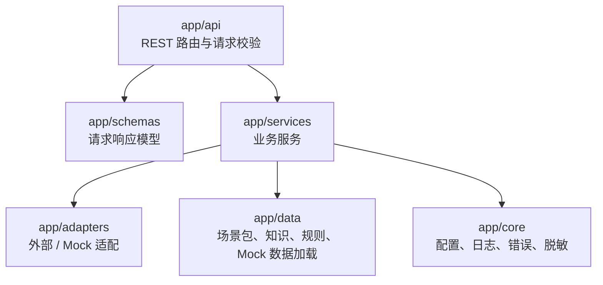
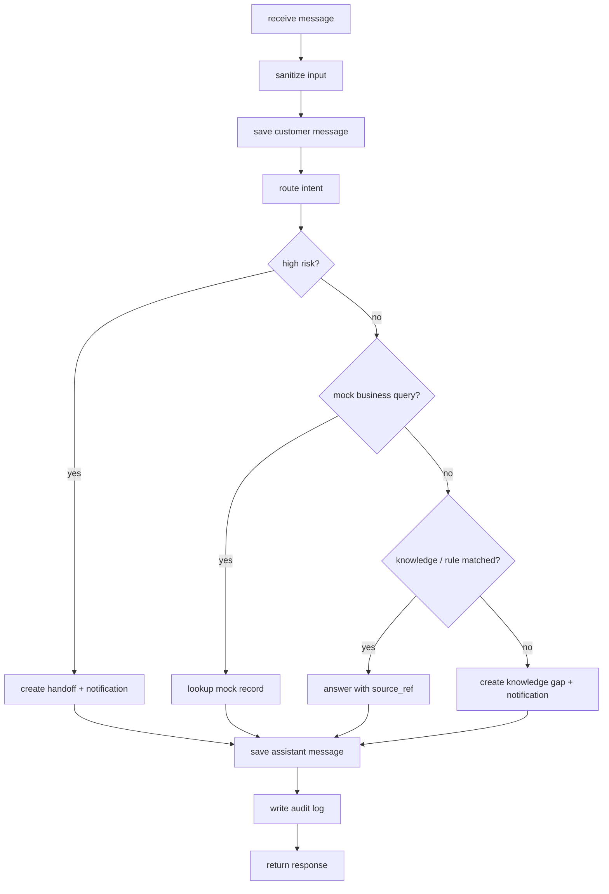

# 后端服务详细设计

> **定位：详细设计。** 本文细化 Phase1 FastAPI 后端服务分层和核心服务职责。

## 0. 文档元信息

| 项 | 内容 |
|---|---|
| 设计对象 | 后端服务分层与核心服务职责 |
| 文档路径 | docs/design/backend-service.md |
| 输入来源 | docs/02-srs.md / 03-prd.md / 04-architecture.md / 05-tech-spec.md / 06-db-design.md / 07-api-spec.md / docs/env/local-env.md |
| 覆盖 REQ / NFR | REQ-002、REQ-003、REQ-004、REQ-005、REQ-006、REQ-008、REQ-009、REQ-011、REQ-012、REQ-013、REQ-016 |
| 所属 Phase | [P1] Demo（Phase2 MVP 增量待补） |
| 交付物形态 | Demo |
| 当前状态 | P1-已实现（Phase1 本机 Demo 已验收，见 docs/09-verification.md §6） |
| 最后更新 | 2026-07-09 |
| 下游影响 | docs/08-dev-plan.md（Sprint-1/2/5/9）、docs/09-verification.md（TC-002/003/012）、backend/、tests/ |

## 1. 目标与范围

后端服务承担 H5、Web 控制台和通知适配的统一 API，负责会话编排、意图路由、知识 / 规则回答、Mock 业务查询、转人工、缺口、摘要与审计。

覆盖需求：REQ-002、REQ-003、REQ-004、REQ-005、REQ-006、REQ-008、REQ-009、REQ-011、REQ-012、REQ-013、REQ-016。

## 2. 分层

## 3. 服务职责

| 服务 | 职责 | 输入 | 输出 |
|---|---|---|---|
| `conversation_service` | 创建会话、记录消息、编排回复 | 会话请求、消息内容 | 会话 / 消息 / 回复 |
| `intent_router` | 识别意图和风险 | 文本、场景包 | 意图、风险、处理动作 |
| `knowledge_service` | 匹配知识条目 | 意图、文本、场景包 | 知识回答 / 未命中 |
| `policy_service` | 匹配规则和高风险策略 | 文本、意图 | 规则回答 / 转人工动作 |
| `business_query_service` | 进度查询编排 | record type / external ref | Mock 业务结果 |
| `handoff_service` | 转人工记录与状态 | 原因、会话、风险 | 转人工对象 |
| `gap_service` | 知识缺口记录与状态 | 问题、会话、标签 | 缺口对象 |
| `notification_service` | 生成通知 payload | 事件、关联对象 | Mock 通知对象 |
| `summary_service` | 汇总日报 | 日期、场景包 | 摘要对象 |
| `audit_service` | 脱敏审计日志 | 动作、资源 | 审计日志 |

## 4. 消息处理伪流程

## 5. 错误处理

- 参数错误返回 `VALIDATION_ERROR`。
- 会话不存在返回 `CONVERSATION_NOT_FOUND`。
- Mock 记录不存在返回 `MOCK_RECORD_NOT_FOUND`，不得自动编造。
- 外部真实集成被调用时返回 `EXTERNAL_INTEGRATION_DISABLED`。
- 未预期错误写脱敏日志，不返回堆栈。

## 6. 数据降级策略

Phase1 可按优先级选择：

1. PostgreSQL 可用：按 `docs/06-db-design.md` 实现。
2. SQLite 可用：用同名近似表结构快速实现。
3. JSON / 内存：用于演示，但必须保持 API 契约稳定。

## 7. 验收

- API-001~API-012 契约可通过手工或自动化测试。
- 高风险、未知、Mock 查询三类分支均可验证。
- 日志脱敏，不含 token、联系方式、真实订单或合同。

## 上游依据与追溯

最低追溯链：`REQ/NFR → Phase → COMP/MOD/Flow → Table/Field → API → Design Point → Sprint/Task → TC`。

| 来源 | 章节 / ID | 本设计承接内容 | 下游影响 |
|---|---|---|---|
| docs/02-srs.md / 03-prd.md | REQ-002/003/004/005/006/008/009/011/012/013/016 | 会话编排、意图路由、知识/规则回答、Mock 业务查询、转人工、缺口、摘要、审计 | 08 / 09 |
| docs/04-architecture.md | COMP-004（Conversation）、COMP-005（Intent Routing）、COMP-012（Summary & Audit）；MOD-005（backend/app/services）、MOD-009（基础设施）；Flow-001（客户问答） | 服务分层、核心服务职责、消息处理流程 | 05 / 06 / 07 |
| docs/06-db-design.md | zycs_conversations、zycs_messages、zycs_rule_items、zycs_daily_summaries、zycs_audit_logs（并经服务触及 zycs_knowledge_items、zycs_human_handoffs、zycs_knowledge_gaps、zycs_notifications、zycs_mock_business_records） | 服务对应的数据对象 | 迁移 / seed |
| docs/07-api-spec.md | API-001 创建会话、API-002 发送消息、API-003 会话列表、API-012 日报摘要（API-004~011 由对应服务支撑） | 服务对外契约 | 代码 / 测试 |
| docs/08-dev-plan.md | 实现散见于 Sprint-1（骨架）、Sprint-2（场景包 / Mock）、Sprint-5（风险兜底）、Sprint-9（知识运营）；未作为任一 Sprint 的显式「输入文档」 | 实现范围 | tasks |
| docs/09-verification.md | TC-002 会话状态保持、TC-003 意图识别、TC-012 日报摘要（经 REQ-002/003/012 推断；09 §3 未显式反向引用本文） | 验收入口 | 验收记录 |

错误码（07 §5，按服务所属 API 归属推断，非 07 显式声明）：`VALIDATION_ERROR`、`CONVERSATION_NOT_FOUND`、`MOCK_RECORD_NOT_FOUND`、`EXTERNAL_INTEGRATION_DISABLED`、`INTERNAL_ERROR`（§5 错误处理已列前四个）。

## 失败、异常与降级路径

| 场景 | 触发条件 | 系统行为 | 用户可见信息 | 记录 / 日志 | 是否阻塞验收 | 关联 TC |
|---|---|---|---|---|---|---|
| 参数错误 | 请求体不合法 | 返回 `VALIDATION_ERROR` | 校验提示 | 脱敏日志 | 否 | TC-013 |
| 会话不存在 | conversation_id 无效 | 返回 `CONVERSATION_NOT_FOUND` | 提示会话失效 | 脱敏日志 | 否 | TC-013 |
| Mock 记录不存在 | 业务编号无对应 Mock | 返回 `MOCK_RECORD_NOT_FOUND`，不编造 | 提示演示数据未找到 | 脱敏日志 | 否 | TC-008 |
| 真实集成被调用 | 触达真实适配器 | 返回 `EXTERNAL_INTEGRATION_DISABLED` | 提示外部集成未开启 | 脱敏日志 | 否 | TC-016 |
| 未预期异常 | 服务层抛错 | 返回 `INTERNAL_ERROR`，不返回堆栈 | 通用错误提示 | 脱敏日志（无 token / 隐私） | 否 | TC-016 |

Mock / 降级 / Demo 与真实能力差异：

| 能力 | 目标设计 | 当前实现 / Demo | Mock / 降级原因 | 是否等价真实能力 | 补齐时点 | 对验收影响 |
|---|---|---|---|---|---|---|
| 业务查询（business_query_service） | 真实 ERP / OA / 工单 | Mock 适配层返回演示数据 | Phase 禁止接真实系统 | 否 | Phase3（需授权 / 安全评审） | Mock 路径已验收，真实路径未覆盖 |
| 通知（notification_service） | 真实飞书机器人 | 生成 payload + send_status=mocked | Phase 禁止真实外发 | 否 | Phase2 / 3 沙箱联调 | Mock payload 已验收 |
| 持久化 | PostgreSQL（06 目标结构） | SQLite / JSON / 内存优先 | Phase1 不强制 DB | 结构等价、性能不等价 | Phase2 技术验证 | API 契约稳定，验收不受影响 |

## 待人工确认项

| ID | 待确认项 | AI 建议 | 建议依据 | 备选方案 | 取舍影响 / 阻塞关系 |
|---|---|---|---|---|---|
| BS-C-001 | 数据降级三级（PG / SQLite / JSON）与交付物形态（Demo / MVP / 产品）的绑定 | Demo=JSON / 内存、MVP=SQLite、产品=PostgreSQL | project-rules §2.5 本机优先、§2 PG 为计划方向 | Demo 即用 PG（需 Docker） | 不阻塞 Phase1；Phase2 技术验证前需定形态 |
| BS-C-002 | 真实业务查询 / 通知的 readiness gate 解锁条件 | Phase3 接入前补授权、限流、重试、脱敏、token 管理 | project-rules §1 Phase 禁令、05 Risk | Phase2 沙箱联调先行 | 不阻塞当前；阻塞 Phase3 |
| BS-C-003 | Phase2 增量（运营配置、基础权限）对本服务分层的影响 | 保留分层，权限落 API / 服务层中间件 | 04 P1、project-rules §1 Phase2 范围 | 独立鉴权服务 | 不阻塞；Phase2 Sprint-7 前细化 |
