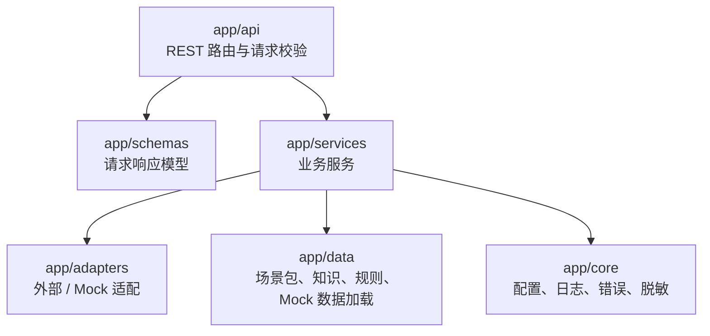
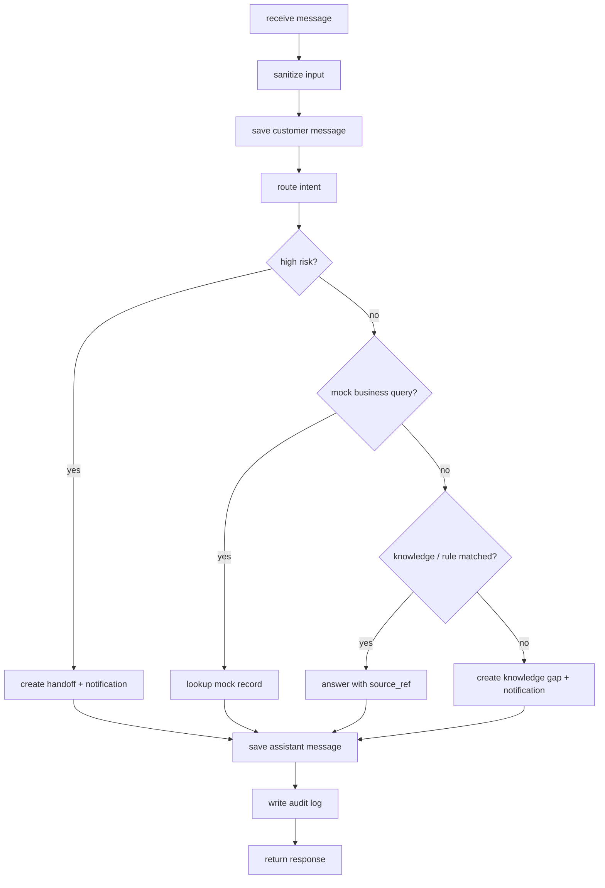

# 后端服务详细设计

> **定位：详细设计。** 本文细化 Phase1 FastAPI 后端服务分层和核心服务职责。

## 1. 目标与范围

后端服务承担 H5、Web 控制台和通知适配的统一 API，负责会话编排、意图路由、知识 / 规则回答、Mock 业务查询、转人工、缺口、摘要与审计。

覆盖需求：REQ-002、REQ-003、REQ-004、REQ-005、REQ-006、REQ-008、REQ-009、REQ-011、REQ-012、REQ-013、REQ-016。

## 2. 分层

## 3. 服务职责

| 服务 | 职责 | 输入 | 输出 |
|---|---|---|---|
| `conversation_service` | 创建会话、记录消息、编排回复 | 会话请求、消息内容 | 会话 / 消息 / 回复 |
| `intent_router` | 识别意图和风险 | 文本、场景包 | 意图、风险、处理动作 |
| `knowledge_service` | 匹配知识条目 | 意图、文本、场景包 | 知识回答 / 未命中 |
| `policy_service` | 匹配规则和高风险策略 | 文本、意图 | 规则回答 / 转人工动作 |
| `business_query_service` | 进度查询编排 | record type / external ref | Mock 业务结果 |
| `handoff_service` | 转人工记录与状态 | 原因、会话、风险 | 转人工对象 |
| `gap_service` | 知识缺口记录与状态 | 问题、会话、标签 | 缺口对象 |
| `notification_service` | 生成通知 payload | 事件、关联对象 | Mock 通知对象 |
| `summary_service` | 汇总日报 | 日期、场景包 | 摘要对象 |
| `audit_service` | 脱敏审计日志 | 动作、资源 | 审计日志 |

## 4. 消息处理伪流程

## 5. 错误处理

- 参数错误返回 `VALIDATION_ERROR`。
- 会话不存在返回 `CONVERSATION_NOT_FOUND`。
- Mock 记录不存在返回 `MOCK_RECORD_NOT_FOUND`，不得自动编造。
- 外部真实集成被调用时返回 `EXTERNAL_INTEGRATION_DISABLED`。
- 未预期错误写脱敏日志，不返回堆栈。

## 6. 数据降级策略

Phase1 可按优先级选择：

1. PostgreSQL 可用：按 `docs/06-db-design.md` 实现。
2. SQLite 可用：用同名近似表结构快速实现。
3. JSON / 内存：用于演示，但必须保持 API 契约稳定。

## 7. 验收

- API-001~API-012 契约可通过手工或自动化测试。
- 高风险、未知、Mock 查询三类分支均可验证。
- 日志脱敏，不含 token、联系方式、真实订单或合同。
