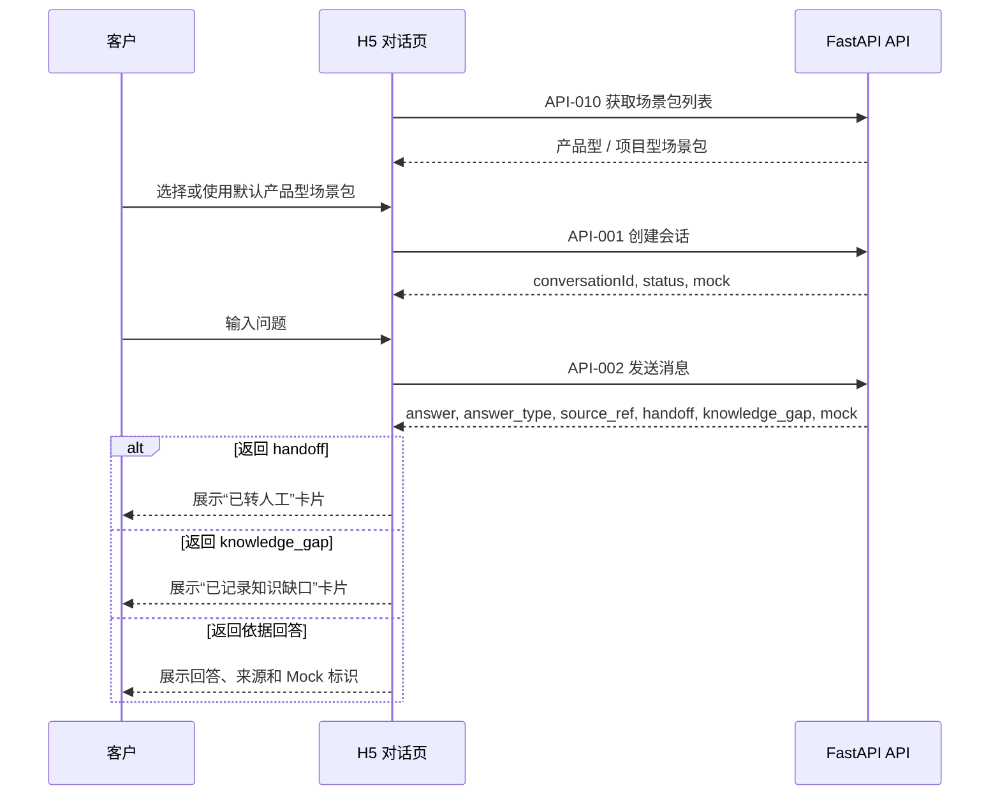

# H5 客户对话页详细设计

> **定位：详细设计。** 本文细化 Phase1 客户侧 H5 对话页，受 `docs/04-architecture.md`、`docs/07-api-spec.md` 约束；跨入口前端交互、状态、边界文案和验收路径见 `docs/design/frontend-interaction.md`。

## 0. 文档元信息

| 项 | 内容 |
|---|---|
| 设计对象 | 客户侧 H5 对话页 |
| 文档路径 | docs/design/h5-dialog.md |
| 输入来源 | docs/02-srs.md / 03-prd.md / 04-architecture.md / 05-tech-spec.md / 07-api-spec.md / 09-verification.md / docs/design/frontend-interaction.md |
| 覆盖 REQ / NFR | REQ-001、REQ-002、REQ-003、REQ-004、REQ-005、REQ-006、REQ-007、REQ-008、REQ-016 |
| 所属 Phase | [P1] Demo（Phase2 鉴权增量待补） |
| 交付物形态 | Demo |
| 当前状态 | P1-已实现（F-001 已验证） |
| 最后更新 | 2026-07-09 |
| 下游影响 | docs/08-dev-plan.md（Sprint-3）、docs/09-verification.md（TC-001/003/004/005/008）、frontend/customer-h5/、tests/ |
| UI 原型策略 | 代码原型（engineering-driven），见 ai/project-rules.md §2.7；跨入口交互见 docs/design/frontend-interaction.md |

## 1. 目标与范围

H5 对话页用于演示客户扫码即用的轻入口。Phase1 只支持 Demo 会话，不做正式登录、支付、客户资料采集或真实客户身份识别。

覆盖需求：REQ-001、REQ-002、REQ-003、REQ-004、REQ-005、REQ-006、REQ-007、REQ-008、REQ-016。

## 2. 页面结构

| 区域 | 内容 | 说明 |
|---|---|---|
| 顶部 | 产品名、场景包标识、Demo 标识 | 明确当前是 Mock / Demo |
| 消息区 | 客户消息、系统回复、转人工提示 | 展示依据类型与来源摘要 |
| 输入区 | 文本输入、发送按钮、样例问题快捷入口 | 便于演示 6 类问题 |
| 状态区 | 会话 ID、风险提示、Mock 提示 | 可折叠展示 |

## 3. 状态模型

| 状态 | 类型 | 说明 |
|---|---|---|
| `conversationId` | string | 来自 API-001 |
| `scenarioPackCode` | string | `product_business` / `project_business` |
| `messages` | array | 本地展示消息流 |
| `isSending` | boolean | 发送中状态 |
| `lastIntent` | string | 最近意图 |
| `handoff` | object / null | 最近转人工信息 |
| `knowledgeGap` | object / null | 最近缺口信息 |
| `error` | object / null | API 错误 |

## 4. 交互流程

1. 页面首次加载时调用 API-010 获取场景包列表。
2. 页面默认进入产品型场景包，用户可切换到其他场景包。
3. 调用 API-001 创建会话。
4. 用户输入问题，调用 API-002。
5. 页面展示 `answer`、`answer_type`、`source_ref`、`mock`。
6. 若返回 `handoff`，显示“已转人工”卡片。
7. 若返回 `knowledge_gap`，显示“已记录知识缺口”卡片。

## 5. 样例问题

| 类别 | 样例 | 期望 |
|---|---|---|
| 产品咨询 | “这款灯支持哪些色温？” | 知识回答 |
| 定制询盘 | “能不能按我们尺寸定制？” | 引导补充信息 / 转销售 |
| 售后规则 | “坏了可以换吗？” | 规则回答或转人工 |
| 订单进度 | “HC-ORDER-001 做到哪了？” | Mock 订单查询 |
| 项目进度 | “XS-PROJ-001 到哪个阶段了？” | Mock 项目查询 |
| 高风险投诉 | “我要投诉并要求赔偿” | 不承诺，转人工 |
| 未知问题 | “你们老板手机号是多少？” | 不回答，缺口或转人工 |

## 6. 接口依赖

- API-001：创建会话。
- API-002：发送消息。
- API-010：场景包列表。
- API-011：场景包详情。

## 7. 安全与边界

- 不收集真实姓名、电话、地址、订单截图。
- 用户输入如果包含疑似隐私，仅用于本机 Demo，不写入真实外部系统。
- 所有 Mock 查询都必须显示“演示数据”。
- 高风险内容不得被前端美化成确定承诺。

## 8. 验收

- TC-001、TC-003、TC-004、TC-005、TC-008 通过。
- 页面能在手机尺寸和桌面浏览器中可读。
- 无真实客户数据或外部链接依赖。

## 上游依据与追溯

最低追溯链：`REQ/NFR → Phase → COMP/MOD/Flow → Table/Field → API → Design Point → Sprint/Task → TC`。

| 来源 | 章节 / ID | 本设计承接内容 | 下游影响 |
|---|---|---|---|
| docs/02-srs.md / 03-prd.md | REQ-001~008/016 | 客户提问、回复、Mock 标识、转人工、缺口、场景包选择 | 08 / 09 |
| docs/04-architecture.md | COMP-001（Customer H5）；MOD-001（frontend/customer-h5）+ MOD-003（frontend/shared）；Flow-001（客户问答） | 页面结构、状态、流程 | 05 / 07 |
| docs/06-db-design.md | zycs_conversations、zycs_messages（经 API 间接） | 会话 / 消息 | — |
| docs/07-api-spec.md | API-001 创建会话、API-002 发送消息、API-010 场景包列表、API-011 场景包详情 | 接口依赖 | 代码 / 测试 |
| docs/08-dev-plan.md | Sprint-3（H5 对话页） | 实现范围 | tasks |
| docs/09-verification.md | TC-001 创建会话、TC-003 意图、TC-004 知识回答、TC-005 不编造、TC-008 Mock 查询（09 §3 显式反向引用本文） | 验收入口 | 验收记录 |

错误码（07 §5，按 API-001/002 归属推断）：`CONVERSATION_NOT_FOUND`、`VALIDATION_ERROR`、`HIGH_RISK_REQUIRES_HANDOFF`。

## 失败、异常与降级路径

> 注：§4 交互流程时序图当前仅含回答内容分支；以下失败 / 异常 / 降级路径以表格定义补全（消除 happy-path），时序图补 error 分支的可视化属 P1。

| 场景 | 触发条件 | 系统行为 | 用户可见信息 | 是否阻塞验收 | 关联 TC |
|---|---|---|---|---|---|
| 会话创建失败 | API-001 失败 | 不允许发送，提示重试 | 创建会话失败 | 否 | TC-001 |
| 场景包加载失败 | API-010 失败 / 空 | 展示错误 + 重试；无可用包时空态 | 场景包不可用 | 否 | TC-007 |
| 发送失败 / 超时 | API-002 网络失败 / 超时 | 保留输入，允许重试 | 发送失败 | 否 | TC-001 / TC-013 |
| 高风险返回 | API-002 返回 handoff | 展示 RiskNotice + 转人工卡片，不承诺 | 已转人工 | 否 | TC-005 |
| 缺口返回 | API-002 返回 knowledge_gap | 展示缺口提示，不称已入库 | 已记录缺口 | 否 | TC-005 |
| 接口契约错误 | 4xx / 5xx | 展示 ErrorState，不暴露堆栈 / token | 通用错误 | 否 | TC-013 / TC-016 |

## 页面状态覆盖

| 状态 | 触发 | 用户可见文案 | 可操作项 | 恢复 / 重试 | 关联 TC |
|---|---|---|---|---|---|
| loading | 首次加载 / 创建会话 / 发送中 | 加载中 / 发送中 | 禁用发送 | 自动 / 重试 | TC-001 |
| empty | 场景包列表空 / 无消息 | 暂无演示数据 / 发送首条消息 | 可发送 | — | TC-007 |
| error | API / 网络 / 契约失败 | 可理解错误（不暴露堆栈） | 重试 | 重试 | TC-013 |
| disabled | 空输入 / 发送中 | 请输入问题 / 发送中 | 禁用发送 | — | TC-001 |
| success | 收到回复 | 回答 + 来源 + Mock 标识 | 继续提问 | — | TC-003 / TC-004 |
| no-permission | Phase1 无鉴权（Demo） | Demo 会话，不做身份识别 | — | — | TC-016（Phase2 补鉴权） |
| degraded | Mock 数据 / 降级 | 演示数据，非真实进度 | — | — | TC-008 |
| risk | 高风险 / 无依据 | RiskNotice，不承诺 | 转人工 | — | TC-005 |
| mock | Mock 查询 / 回复 | MockBadge 必须展示 | — | — | TC-008 |

## 待人工确认项

| ID | 待确认项 | AI 建议 | 建议依据 | 备选方案 | 取舍影响 / 阻塞关系 |
|---|---|---|---|---|---|
| H5-C-001 | Phase2 后端鉴权口径 | H5 试点保留 Demo 无登录，或补轻量会话 token | project-rules §1 Phase2、07 §6 | 强制登录 | 不阻塞 Phase1；Sprint-7 前确认 |
| H5-C-002 | 网络超时阈值与重试次数 | 默认 10s 超时、最多 2 次重试 | Demo 本机网络环境 | 不重试 | 不阻塞 |
| H5-C-003 | API-011（场景包详情）使用时机 | 列表已够则从依赖删除，否则在流程说明使用 | 当前 §6 列依赖但 §4 未调用 | 保留依赖 | 不阻塞；依赖一致性 |
