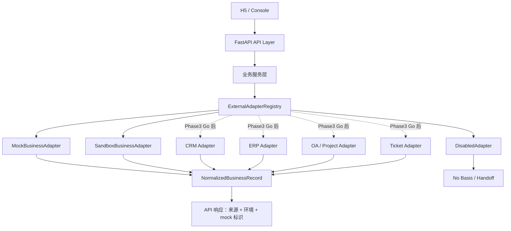

# Phase3 外部系统适配层契约设计

> **定位：详细设计 / Phase3 准备规划。** 本文只定义 CRM / ERP / OA / 工单 / 飞书项目等真实业务系统适配层契约与 Mock / sandbox 骨架边界，不接真实生产系统。

## 0. 文档元信息

| 项 | 内容 |
|---|---|
| 设计对象 | 外部业务系统适配层契约（CRM / ERP / OA / 工单 / 飞书项目） |
| 文档路径 | docs/design/integration-adapters.md |
| 输入来源 | docs/03-prd.md / 04-architecture.md / 05-tech-spec.md / 07-api-spec.md / docs/research/2026-07-11-phase3-upgrade-evaluation.md / docs/research/2026-07-11-phase3-integration-questionnaire.md / docs/research/2026-07-11-phase3-security-data-boundary-review.md |
| 覆盖 REQ / NFR | REQ-008、REQ-009、REQ-016 |
| 所属 Phase | [P3] 准备规划（真实实施 No-Go） |
| 交付物形态 | 设计契约 / Mock / sandbox 骨架口径 |
| 当前状态 | Draft：准备规划已补；真实接入等待 RG-004/RG-005/RG-006 |
| 最后更新 | 2026-07-11 |
| 下游影响 | docs/08-dev-plan.md、docs/09-verification.md、backend/app/adapters/、tests/ |

## 1. 目标与范围

目标：为 Phase3 真实业务系统集成定义稳定的适配层边界，使后端主链路只依赖统一契约，不直接依赖 CRM / ERP / OA / 工单 / 飞书项目的私有接口。

覆盖能力：

- 订单 / 项目 / 工单只读查询。
- 外部系统来源、环境和 `source_ref` 追溯。
- 超时、限流、权限不足、无记录、数据敏感等失败场景统一降级。
- Mock / sandbox / disabled 模式切换。
- 真实凭据、生产数据、真实 LLM 调用的安全边界。

不覆盖能力：

- 不写回生产 CRM / ERP / OA / 工单系统。
- 不订阅生产事件回调；飞书事件回调另行评估。
- 不处理真实客户隐私、合同、报价、联系方式或生产会话。
- 不启用真实 LLM API，不把外部业务数据发送给 LLM。

## 2. 适配层位置

设计原则：

- API 层不直接调用外部系统 SDK / HTTP 客户端。
- 业务服务只读统一 `ExternalBusinessAdapter` 契约。
- 每个真实系统适配器只做协议转换、鉴权封装、字段映射和错误标准化。
- 外部系统失败时不得编造业务事实，必须返回无依据、缺口或转人工。

## 3. 运行模式

| 模式 | 用途 | 是否可默认 | 是否允许真实外部调用 | 说明 |
|---|---|---|---|---|
| `disabled` | 明确关闭外部集成 | 可 | 否 | 返回 `EXTERNAL_INTEGRATION_DISABLED` 或转人工 |
| `mock` | 本机 Demo / 默认降级 | 是 | 否 | 读取 Mock / seed 数据，响应 `mock: true` |
| `sandbox` | 客户沙箱 / 测试环境 PoC | 否，需确认 | 仅沙箱 | 需 RG-004/RG-005 部分满足，不含生产数据 |
| `production_readonly` | 生产只读 PoC | 否，需单独授权 | 是，只读 | 需 RG-004/RG-005/RG-006 Go；本文不解锁 |
| `production_write` | 写回生产系统 | 否 | 是，写入 | Phase3 首轮不建议；需独立评估和审计 |

建议环境变量命名预留：

- `ZYCS_EXTERNAL_INTEGRATION_MODE=disabled|mock|sandbox|production_readonly`
- `ZYCS_EXTERNAL_SYSTEMS=crm,erp,oa,ticket,feishu_project`
- 各系统凭据只允许通过本机 / 部署环境变量或安全配置中心注入，不写入仓库。

## 4. 统一契约草案

### 4.1 适配器接口

| 方法 | 输入 | 输出 | 说明 |
|---|---|---|---|
| `query_business_record(record_type, external_ref, context)` | `record_type`、业务编号、场景包、操作者角色 | `ExternalQueryResult` | 订单 / 项目 / 工单只读查询 |
| `health_check()` | 无敏感输入 | `AdapterHealth` | 检查沙箱配置、网络和权限，不返回密钥 |
| `describe_capabilities()` | 无 | `AdapterCapabilities` | 返回支持的 record_type、模式、是否可写 |

首个 PoC 仅实现 `query_business_record` 的只读查询；`production_write` 不进入本阶段。

### 4.2 统一查询结果

| 字段 | 类型 | 必填 | 说明 |
|---|---|---|---|
| `record_type` | string | 是 | `order` / `project` / `ticket` / 扩展类型 |
| `external_ref` | string | 是 | 外部业务编号；展示前可脱敏 |
| `status` | string | 是 | 统一状态文案或标准状态码 |
| `summary` | string | 是 | 可展示摘要；不得包含内部敏感备注 |
| `eta` | string/null | 否 | 已确认日期；未知时为 null，不编造 |
| `source_system` | string | 是 | `mock` / `crm` / `erp` / `oa` / `ticket` / `feishu_project` |
| `source_ref` | string | 是 | 可追溯来源，如 `erp:order:HC-ORDER-001` |
| `environment` | string | 是 | `mock` / `sandbox` / `production_readonly` |
| `mock` | boolean | 是 | 是否 Mock 数据 |
| `updated_at` | string | 是 | 来源系统更新时间或查询时间 |
| `redaction_applied` | boolean | 是 | 是否执行脱敏 / 字段裁剪 |

### 4.3 上下文对象

| 字段 | 说明 |
|---|---|
| `scenario_pack_code` | 场景包，控制字段映射和展示文案 |
| `request_id` | 用于日志关联，不含敏感数据 |
| `actor_role` | `admin` / `viewer` / system；首个 PoC 不因角色扩大外部权限 |
| `allowed_fields` | 本次查询允许返回的字段白名单 |
| `risk_policy` | 高风险 / 无依据时的转人工策略 |

## 5. 错误与降级

| 错误码 | 场景 | 处理策略 | 是否可重试 | 用户可见文案 |
|---|---|---|---|---|
| `EXTERNAL_INTEGRATION_DISABLED` | 模式 disabled 或系统未授权 | 转人工 / Mock 降级 | 否 | 当前未启用真实系统查询 |
| `EXTERNAL_AUTH_REQUIRED` | 缺凭据或权限不足 | 停止调用，提示配置问题 | 否 | 真实系统授权未完成 |
| `EXTERNAL_RECORD_NOT_FOUND` | 外部系统无记录 | 不编造，创建缺口或转人工 | 否 | 未查询到可用依据 |
| `EXTERNAL_TIMEOUT` | 超时 | 熔断 / 转人工 / 稍后重试 | 是 | 查询超时，已转人工跟进 |
| `EXTERNAL_RATE_LIMITED` | 限流 | 退避重试，不打爆外部系统 | 是 | 系统繁忙，稍后再试 |
| `EXTERNAL_DATA_REDACTED` | 字段敏感被裁剪 | 返回最小可展示字段 | 否 | 部分信息需人工确认 |
| `EXTERNAL_HIGH_RISK` | 赔付 / 合同 / 法务 / 隐私 | 强制转人工 | 否 | 该问题需人工处理 |

## 6. 字段映射与脱敏

字段映射必须由 `docs/research/2026-07-11-phase3-integration-questionnaire.md` 填写后确认。未确认字段不得进入真实适配器。

| 对象 | 最小字段 | 禁止默认返回 |
|---|---|---|
| 订单 | 编号、状态、可公开进度、已确认 ETA、来源系统 | 合同金额、成本、内部备注、客户隐私、未确认交期 |
| 项目 | 编号、阶段、可公开摘要、下一步、来源系统 | 内部排期冲突、成本、人员隐私、合同条款 |
| 工单 | 编号、状态、可公开处理进度、更新时间 | 内部责任人隐私、赔付建议、敏感备注 |
| 客户 / 联系人 | 默认不返回 | 手机、地址、身份证、微信 / 飞书 ID、完整联系人信息 |

## 7. 日志与审计

允许记录：

- `request_id`、`source_system`、`record_type`、脱敏后的 `external_ref`。
- 调用耗时、状态码、标准错误码、是否降级。
- 操作者角色、操作类型、时间。

禁止记录：

- API key、secret、token、Authorization、cookie、私钥。
- 真实客户联系方式、身份证、地址、合同 / 报价 / 成本细节。
- 完整外部系统原始响应。
- 可还原生产数据的 LLM prompt / response。

## 8. 验收用例草案

| TC-ID | 场景 | 前置 | 期望 |
|---|---|---|---|
| TC-P3-001 | Mock 模式订单查询 | `ZYCS_EXTERNAL_INTEGRATION_MODE=mock` | 返回 `mock: true`、`source_system=mock`、可追溯 `source_ref` |
| TC-P3-002 | disabled 模式查询 | `ZYCS_EXTERNAL_INTEGRATION_MODE=disabled` | 不调用外部系统，返回禁用 / 转人工 |
| TC-P3-003 | sandbox 无凭据 | `sandbox` 但缺配置 | 返回 `EXTERNAL_AUTH_REQUIRED`，不泄露配置值 |
| TC-P3-004 | 外部无记录 | sandbox / mock 均可 | 不编造，返回无依据 / 缺口 / 转人工 |
| TC-P3-005 | 高风险问题 | 赔付 / 合同 / 隐私关键词 | 强制转人工，不调用 LLM 自动答复 |

## 9. Readiness Gate 对应关系

| Gate | 本设计要求 | 当前状态 |
|---|---|---|
| RG-004 真实业务系统授权 | 问卷明确系统、接口、授权、沙箱和验收场景 | No-Go |
| RG-005 数据安全与隐私 | 安全边界清单确认数据分类、日志和凭据规则 | No-Go |
| RG-006 集成适配层契约 | 本文定义契约；代码实现需另开任务 | Draft |
| RG-007 飞书事件回调 | 仅预留，不在本文启用 | Not Started |
| RG-008 LLM 启用授权 | 保持 disabled / Mock，不进入适配层默认能力 | Blocked |

## 10. 上游依据与追溯

| 来源 | 章节 / ID | 本设计承接内容 | 下游影响 |
|---|---|---|---|
| `ai/project-rules.md` | §1、§5.2 | 真实系统、真实数据、LLM 接入禁区 | Phase3 Go / No-Go |
| `docs/03-prd.md` | Phase3 路线图、REQ-008/009/016 | 真实业务系统集成目标 | Phase3 规划 |
| `docs/05-tech-spec.md` | 外部业务系统 / 适配层 / 风险 | CRM / ERP / OA / 工单适配候选 | 后端设计 |
| `docs/07-api-spec.md` | API-007/008/009 | Mock 查询与通知现有契约 | API 扩展 |
| `docs/research/2026-07-11-phase3-upgrade-evaluation.md` | RG-004~RG-008 | Phase3 准备规划结论 | 08 / 09 |
| `docs/research/2026-07-11-phase3-integration-questionnaire.md` | 系统清单 / 字段映射 | 真实适配器输入条件 | RG-004 |
| `docs/research/2026-07-11-phase3-security-data-boundary-review.md` | 数据 / 凭据 / 日志边界 | 安全红线 | RG-005 |

## 11. 后续实现边界

若后续进入编码任务，建议顺序：

1. 只实现 `ExternalBusinessAdapter` 抽象、`DisabledAdapter`、现有 Mock 包装，不改变现有 API 行为。
2. 增加 sandbox adapter skeleton，仅读取环境变量并在缺配置时安全失败。
3. 等 RG-004/RG-005 Go 后，再按客户接口实现单系统只读 PoC。
4. 任何真实生产只读 / 写入 / 回调 / LLM 调用都必须单独任务、单独授权、单独验收。

