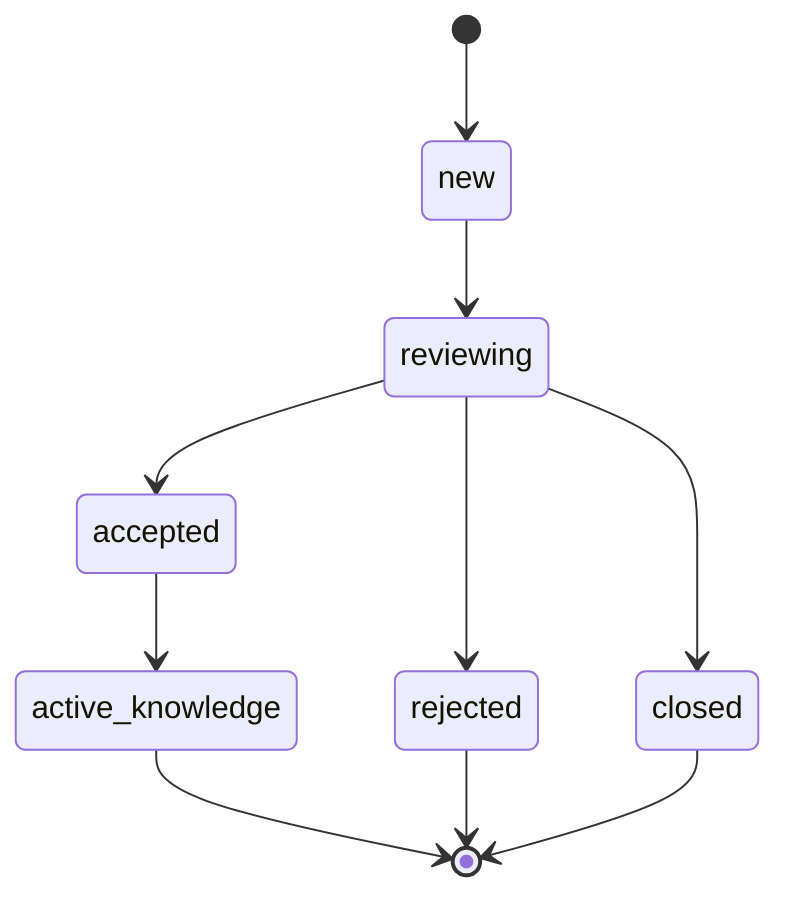

# 知识库与规则策略详细设计

> **定位：详细设计。** 本文细化知识、规则、不编造、高风险转人工和知识缺口机制。

## 0. 文档元信息

| 项 | 内容 |
|---|---|
| 设计对象 | 知识库、规则、不编造、高风险转人工与知识缺口机制 |
| 文档路径 | docs/design/knowledge-and-policy.md |
| 输入来源 | docs/02-srs.md / 03-prd.md / 04-architecture.md / 05-tech-spec.md / 06-db-design.md / 07-api-spec.md / docs/decisions/ADR-0004-no-fabrication-and-human-handoff.md |
| 覆盖 REQ / NFR | REQ-003、REQ-004、REQ-005、REQ-011、REQ-012、REQ-016 |
| 所属 Phase | [P1] Demo（Phase2 知识运营强化待补） |
| 交付物形态 | Demo |
| 当前状态 | P1-已实现（Phase1 不编造 / 高风险兜底基线）；知识缺口 accepted 入库强化属 Sprint-9 / Phase2 |
| 最后更新 | 2026-07-09 |
| 下游影响 | docs/08-dev-plan.md（Sprint-2/5/9）、docs/09-verification.md（TC-004/005/011/016）、backend/app/services/、tests/ |

## 1. 目标与范围

Phase1 采用可追溯知识 / 规则匹配，不默认启用 LLM。系统必须能说明回答来自知识、规则、Mock 数据或转人工策略；无依据时不得编造。

覆盖需求：REQ-003、REQ-004、REQ-005、REQ-011、REQ-012、REQ-016。

## 2. 知识类型

| 类型 | 示例 | Phase1 处理 |
|---|---|---|
| 产品知识 | 参数、规格、选型、定制说明 | 场景包 seed 数据 |
| 项目知识 | 开发阶段、资料、配合事项 | 场景包 seed 数据 |
| 售后规则 | 退换货、维保、故障处理 | 规则 + 知识 |
| 运营话术 | 留资引导、转人工说明 | 模板 |
| 高风险规则 | 投诉、赔付、合同、价格、交期承诺 | 强制转人工 |

## 3. 匹配策略

Phase1 默认按规则和关键词匹配：

1. 先执行高风险规则。
2. 再执行进度查询规则。
3. 再匹配场景包知识和规则。
4. 未命中则创建知识缺口。

后续可增加向量检索，但必须保留 `source_ref` 和证据回溯。

## 4. 不编造策略

必须转人工或缺口的情况：

- 问题涉及价格、合同、赔付、交期承诺、法律责任。
- 用户要求真实订单 / 项目数据，但 Mock 中不存在记录。
- 知识库没有依据。
- 用户提供疑似隐私或生产数据。
- 问题超出当前场景包范围。

## 5. 知识缺口生命周期

Phase1 可实现到 `new`、`reviewing`、`closed`，`accepted` 后入库作为 Sprint-9（知识运营强化）或 Phase2 强化。

## 6. 高风险转人工规则

| 规则 | 关键词 / 条件 | 动作 |
|---|---|---|
| 投诉舆情 | 投诉、曝光、抖音、维权 | 转人工，风险 high |
| 赔付承诺 | 赔钱、补偿、赔偿 | 转人工，风险 high |
| 合同责任 | 合同、违约、责任 | 转人工，风险 high |
| 价格承诺 | 最低价、报价、打折 | 转人工，风险 medium / high |
| 交期承诺 | 保证交期、一定到货 | 转人工，风险 medium / high |
| 隐私数据 | 手机、地址、身份证、账号 | 脱敏提示，转人工或拒收 |

## 7. 验收

- TC-004、TC-005、TC-011、TC-016 通过。
- 自动回复必须有 `source_ref`。
- 无依据问题不能输出伪事实。

## 上游依据与追溯

最低追溯链：`REQ/NFR → Phase → COMP/MOD/Flow → Table/Field → API → Design Point → Sprint/Task → TC`。

| 来源 | 章节 / ID | 本设计承接内容 | 下游影响 |
|---|---|---|---|
| docs/02-srs.md / 03-prd.md | REQ-003/004/005/011/012/016 | 知识 / 规则匹配、不编造、高风险转人工、知识缺口 | 08 / 09 |
| docs/04-architecture.md | COMP-006（Knowledge & Policy）、COMP-010（Knowledge Gap）；MOD-005；Flow-001（客户问答）、Flow-003（知识缺口）、Flow-004（转人工） | 匹配策略、缺口生命周期、高风险规则 | 05 / 06 / 07 |
| docs/06-db-design.md | zycs_knowledge_items、zycs_rule_items、zycs_knowledge_gaps、zycs_messages、zycs_human_handoffs、zycs_audit_logs（含 source_ref / rule_type / priority / enabled 字段） | 知识 / 规则 / 缺口数据对象 | 迁移 / seed |
| docs/07-api-spec.md | API-002 发送消息、API-004 转人工、API-005 缺口、API-006 知识候选 | 回复 / 缺口 / 转人工契约 | 代码 / 测试 |
| docs/08-dev-plan.md | Sprint-2（seed）、Sprint-5（不编造 / 高风险兜底）、Sprint-9（缺口流转 / 审核强化） | 实现范围 | tasks |
| docs/09-verification.md | TC-004 知识 / 规则回答、TC-005 不编造与高风险保护、TC-011 知识缺口生命周期、TC-016 安全隐私（09 §3 显式反向引用本文 TC-005/011；TC-004 经 REQ-004 推断） | 验收入口 | 验收记录 |

错误码（07 §5，按 API-002/005/006 归属推断，非 07 显式声明）：`HIGH_RISK_REQUIRES_HANDOFF`、`VALIDATION_ERROR`。

## 失败、异常与降级路径

| 场景 | 触发条件 | 系统行为 | 用户可见信息 | 记录 / 日志 | 是否阻塞验收 | 关联 TC |
|---|---|---|---|---|---|---|
| 高风险命中 | 价格 / 合同 / 赔付 / 交期 / 隐私关键词 | 强制转人工（COMP-009 / handoff），返回 `HIGH_RISK_REQUIRES_HANDOFF` | RiskNotice，不承诺 | 脱敏审计 | 否 | TC-005 |
| 知识 / 规则未命中 | 无依据或超场景包 | 创建知识缺口（COMP-010），不编造 | 缺口提示 | 审计 | 否 | TC-004 / TC-011 |
| Mock 数据缺失 | 用户要真实数据但 Mock 无记录 | 不编造，转缺口 / 转人工 | 提示无依据 | 审计 | 否 | TC-005 |
| 真实数据疑似输入 | 含手机 / 身份证等 | 脱敏提示，转人工或拒收 | 隐私提示 | 脱敏审计 | 否 | TC-016 |

候选 / 默认关闭能力与真实能力差异：

| 能力 | 目标设计 | 当前实现 / Demo | Mock / 降级原因 | 是否等价真实能力 | 补齐时点 | 对验收影响 |
|---|---|---|---|---|---|---|
| LLM 自动答复 | 证据约束 + 不编造 + 成本 + 兜底 | 默认关闭，规则 / 关键词匹配 | project-rules §1 Phase2 仅评估、05 RG | 否 | DOC-C-005 / Phase2 评估 | 当前验收不依赖 LLM |
| 向量检索 / Embedding | 保留 source_ref + 证据回溯的向量召回 | 未启用，关键词 / 规则匹配 | Docker TEI 候选默认关闭 | 否 | Phase2 技术验证 | 不影响 Phase1 验收 |
| accepted 缺口入库 | 人工审核后入知识库 | Phase1 到 closed，accepted 强化在 Sprint-9 | 范围控制 | 否 | Sprint-9 | 不影响 Phase1 |

## 待人工确认项

| ID | 待确认项 | AI 建议 | 建议依据 | 备选方案 | 取舍影响 / 阻塞关系 |
|---|---|---|---|---|---|
| KP-C-001 | LLM 启用边界（证据 / 不编造 / 成本 / 兜底） | Phase2 评估完成（Conditional Go，2026-07-11），不默认启用；未来走外部 LLM API，不采用本地小模型 | project-rules §1、05 RG-003、ADR-0004、`docs/research/2026-07-11-tech-env-evaluation-llm.md` | Phase3 启用 | 不阻塞当前；阻塞 LLM 上线 |
| KP-C-002 | 向量检索引入时点 | Phase2 技术验证后再定 | 05 TEI 候选默认关闭 | 保持关键词匹配 | 不阻塞当前 |
| KP-C-003 | accepted 缺口入库归属 | Sprint-9（知识运营强化） | 08 Sprint-9 输入含本文 | Phase2 早期 | 不阻塞 Phase1；Sprint-9 前确认 |
| KP-C-004 | 高风险规则是否配置化（zycs_rule_items rule_type=risk） | 规则入 06 表，不在代码硬编码 | project-rules §5.1 场景包 / 规则须可追溯配置 | 代码内置 | 不阻塞；硬编码违反 §5.1 |
