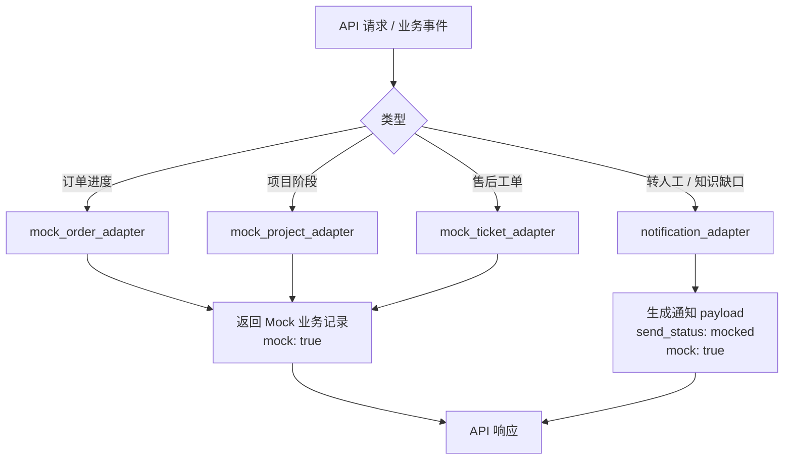

# Mock 集成层详细设计

> **定位：详细设计。** 本文细化 Phase1 外部系统与飞书通知的 Mock 适配方式。

## 0. 文档元信息

| 项 | 内容 |
|---|---|
| 设计对象 | 外部系统与飞书通知的 Mock 适配层 |
| 文档路径 | docs/design/mock-integrations.md |
| 输入来源 | docs/02-srs.md / 03-prd.md / 04-architecture.md / 05-tech-spec.md / 06-db-design.md / 07-api-spec.md / docs/env/local-env.md |
| 覆盖 REQ / NFR | REQ-008、REQ-014、REQ-017、REQ-018、REQ-019、REQ-022 |
| 所属 Phase | [P1] Demo；[P2.5]/[P3A] Product Sandbox；真实集成属 Phase3B |
| 交付物形态 | Demo / Product Sandbox |
| 当前状态 | P1-已实现；Product Sandbox Mock 数据源模式增量待实现 |
| 最后更新 | 2026-07-15 |
| 下游影响 | docs/08-dev-plan.md（Sprint-2/8）、docs/09-verification.md（TC-008/009/016）、backend/app/adapters/、tests/ |

## 1. 目标与范围

Phase1 不连接真实 CRM / ERP / OA / 工单 / 飞书组织 / 企业微信会话存档。所有外部能力通过 Mock 适配层演示接口、payload 和状态流转。

覆盖需求：REQ-008、REQ-009、REQ-014、REQ-016。

## 2. Mock 适配器

| 适配器 | 真实系统候选 | Phase1 行为 |
|---|---|---|
| `mock_order_adapter` | ERP / 订单系统 | 按 Mock 订单号返回状态 |
| `mock_project_adapter` | OA / 飞书项目 / 项目系统 | 按 Mock 项目号返回阶段 |
| `mock_ticket_adapter` | 工单 / 售后系统 | 按 Mock 售后单号返回进度 |
| `notification_adapter` | 飞书机器人 / 企业微信内部群 | 生成 payload 并记录为 `mocked` |

## 3. Mock 数据示例

| 类型 | 编号 | 场景包 | 状态 |
|---|---|---|---|
| order | `HC-ORDER-001` | 产品型 | 生产排期中 |
| order | `HC-ORDER-002` | 产品型 | 质检中 |
| order | `DEMO-ORDER-202607-001` | 产品型 | 生产中 |
| order | `DEMO-ORDER-202607-002` | 产品型 | 质检中 |
| project | `XS-PROJ-001` | 项目型 | 方案开发阶段 |
| project | `XS-PROJ-002` | 项目型 | 联调测试阶段 |
| ticket | `XS-TICKET-001` | 项目型 | 售后处理中 |
| project | `DEMO-PROJ-202607-001` | 项目型 | 联调准备中 |
| ticket | `DEMO-TICKET-202607-001` | 项目型 | 处理中 |

Demo Sandbox 标准模拟数据（task-010a）在保留上述旧编号兼容的同时，新增 `DEMO-*` 规范编号。每条标准记录必须包含：

- `source_ref`：如 `demo_erp:order:DEMO-ORDER-202607-001`。
- `source_system`：如 `demo_erp`、`demo_project`、`demo_ticket`。
- `environment`: `demo_sandbox`。
- `stage`：可迁移的英文状态码，如 `in_production`、`quality_check`、`integration_preparing`。
- `payload.schema_version`: `demo_sandbox.v1`。
- `payload.customer`、`payload.business_object`、`payload.progress_nodes`、`payload.allowed_display_fields`、`payload.redaction_applied`。
- `mock`: `true` / `is_mock`: `true`，不得冒充真实生产数据。

## 4. 通知 payload

转人工通知字段：

- `event_type`: `handoff`
- `conversation_id`
- `reason`
- `risk_level`
- `suggested_owner`
- `summary`
- `mock`: `true`

知识缺口通知字段：

- `event_type`: `knowledge_gap`
- `gap_id`
- `question`
- `scenario_pack_code`
- `suggested_tags`
- `mock`: `true`

## 5. 真实集成升级条件

进入 Phase2.5 / Phase3B 前需另行确认：

- 外部系统授权方式和测试环境。
- 数据最小化策略。
- 错误重试和限流。
- 日志脱敏与审计。
- token / secret 管理方式。

## 6. 验收

- TC-008、TC-009、TC-016、TC-060 通过。
- 外部集成默认关闭；误调用真实适配器返回 `EXTERNAL_INTEGRATION_DISABLED`。

## 上游依据与追溯

最低追溯链：`REQ/NFR → Phase → COMP/MOD/Flow → Table/Field → API → Design Point → Sprint/Task → TC`。

| 来源 | 章节 / ID | 本设计承接内容 | 下游影响 |
|---|---|---|---|
| docs/02-srs.md / 03-prd.md | REQ-008/009/014/016 | Mock 业务查询、Mock 通知、配置可替换、安全隐私 | 08 / 09 |
| docs/04-architecture.md | COMP-008（Business Adapter）、COMP-011（Notification Adapter）；MOD-006（backend/app/adapters）；Flow-002（进度 Mock 查询）、Flow-003（知识缺口）、Flow-004（转人工） | 适配器职责、Mock 分发 | 05 / 06 / 07 |
| docs/06-db-design.md | zycs_mock_business_records、zycs_notifications（is_mock / send_status 字段） | Mock 业务记录、通知对象 | seed |
| docs/07-api-spec.md | API-007 单条 Mock 记录、API-008 Mock 数据列表、API-009 Mock 通知（API-004/005 由通知适配器配合转人工 / 缺口） | Mock 接口契约 | 代码 / 测试 |
| docs/08-dev-plan.md | Sprint-2（场景包 / Mock）、Sprint-8（飞书沙箱 + DB 技术验证） | 实现范围 | tasks |
| docs/09-verification.md | TC-008 Mock 进度查询、TC-009 Mock 通知、TC-016 安全隐私（09 §3 显式反向引用本文 TC-008；TC-009/016 经 REQ 推断） | 验收入口 | 验收记录 |

错误码（07 §5，按 API-007/009 归属）：`MOCK_RECORD_NOT_FOUND`、`EXTERNAL_INTEGRATION_DISABLED`。

## Mock 路径状态机

| 状态 | 含义 | 进入条件 | 退出条件 | 用户 / 系统可见表现 | 终态 |
|---|---|---|---|---|---|
| received | 收到查询 / 事件请求 | API / 业务事件触发 | 分类完成 | — | 否 |
| classified | 已分流到适配器 | 类型判定完成 | 适配器返回 | — | 否 |
| mocked | 返回 Mock 记录 / payload | 命中 Mock 数据 | 写入响应 | `mock:true` / `send_status:mocked` | 是 |
| not_found | Mock 记录不存在 | 业务编号无对应 | 返回错误 | `MOCK_RECORD_NOT_FOUND` | 是（失败） |
| disabled | 真实集成被触达 | 触达真实适配器 | 返回错误 | `EXTERNAL_INTEGRATION_DISABLED` | 是（失败） |

## 幂等、重试、超时与限流基线

- **幂等**：Mock 查询按 `record_type + external_ref` 幂等（同编号同结果）；通知按 `event_type + 关联对象 + 时间窗` 去重。
- **重试**：Phase1 Mock 路径不重试（本地数据，无瞬态失败）；真实集成接入后按适配器定义重试（默认 3 次、指数退避，Phase3B 前确认）。
- **超时**：Mock 路径无外部 IO，不设超时；真实适配器默认超时 5s（Phase3B 前确认）。
- **限流**：Phase1 不限流（本机 Demo）；真实集成按 token 配额与 429 退避（Phase3B 前确认）。

## 失败、异常与降级路径

| 场景 | 触发条件 | 系统行为 | 用户可见信息 | 记录 / 日志 | 是否阻塞验收 | 关联 TC |
|---|---|---|---|---|---|---|
| Mock 记录不存在 | 业务编号无对应 | 返回 `MOCK_RECORD_NOT_FOUND`，不编造 | 演示数据未找到 | 审计 | 否 | TC-008 |
| 真实集成被触达 | 触达真实适配器 | 返回 `EXTERNAL_INTEGRATION_DISABLED` | 外部集成未开启 | 审计 | 否 | TC-016 |
| 通知生成失败 | payload 构造异常 | 不外发，记录 `send_status=failed` | 通知未生成 | 审计 | 否 | TC-009 |

Mock 与真实能力差异：

| 能力 | 目标设计 | 当前实现 / Demo | Mock / 降级原因 | 是否等价真实能力 | 补齐时点 | 对验收影响 |
|---|---|---|---|---|---|---|
| 业务查询 | 真实 ERP / OA / 工单 | Mock / Product Sandbox 适配层 | Phase 禁令 | 否 | Phase3B | Mock 已验收，Product Sandbox 待实现 |
| 飞书通知 | 真实飞书机器人 | payload + `mocked` | Phase 禁令 | 否 | Phase2 / 3 沙箱 | Mock 已验收 |

## 待人工确认项

| ID | 待确认项 | AI 建议 | 建议依据 | 备选方案 | 取舍影响 / 阻塞关系 |
|---|---|---|---|---|---|
| MI-C-001 | 真实集成 readiness（授权 / 测试环境） | Phase3B 前补外部系统授权与沙箱 | project-rules §1 | Phase2 沙箱先行 | 阻塞 Phase3B 真实集成 |
| MI-C-002 | 数据最小化策略 | 只取演示必要字段 | project-rules §5.1 / §1 | 全量返回 | 不阻塞；隐私合规相关 |
| MI-C-003 | 错误重试 / 限流基线 | 真实接入时补（3 次 / 指数退避 / 5s 超时 / 429 退避） | 本设计「幂等重试超时限流基线」 | 按适配器自定义 | 不阻塞 Phase1；阻塞 Phase3B |
| MI-C-004 | token / secret 管理 | 真实接入时用 secrets / 环境变量，不入库不入日志 | project-rules §5.2 | 配置文件明文 | 不阻塞；阻塞真实接入 |

## Product Sandbox Mock 集成增量（Phase2.5 / Phase3A，2026-07-15）

- Mock 适配器需从场景包绑定的 Demo Dataset 读取订单 / 项目 / 售后记录，并返回 `source_mode=demo_sandbox`、`scenario_pack`、`source_ref`、`mock=true`。
- Demo reset 不重置基础 Demo Dataset，只重置运行态（会话、缺口、转人工、通知、摘要等）。
- Mock 查询无记录时不编造；提示“当前演示数据未包含该记录”，可转人工。
- 与真实适配器的边界：Product Sandbox 可模拟业务结果，但不等价于真实系统集成。
- 关联验收：TC-067、TC-068、TC-071。
