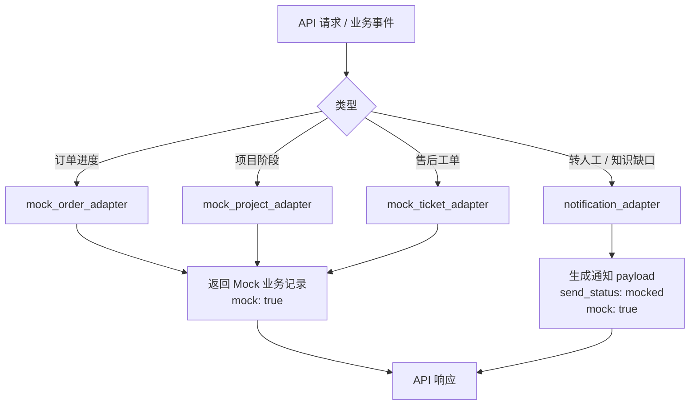

# Mock 集成层详细设计

> **定位：详细设计。** 本文细化 Phase1 外部系统与飞书通知的 Mock 适配方式。

## 1. 目标与范围

Phase1 不连接真实 CRM / ERP / OA / 工单 / 飞书组织 / 企业微信会话存档。所有外部能力通过 Mock 适配层演示接口、payload 和状态流转。

覆盖需求：REQ-008、REQ-009、REQ-014、REQ-016。

## 2. Mock 适配器

| 适配器 | 真实系统候选 | Phase1 行为 |
|---|---|---|
| `mock_order_adapter` | ERP / 订单系统 | 按 Mock 订单号返回状态 |
| `mock_project_adapter` | OA / 飞书项目 / 项目系统 | 按 Mock 项目号返回阶段 |
| `mock_ticket_adapter` | 工单 / 售后系统 | 按 Mock 售后单号返回进度 |
| `notification_adapter` | 飞书机器人 / 企业微信内部群 | 生成 payload 并记录为 `mocked` |

## 3. Mock 数据示例

| 类型 | 编号 | 场景包 | 状态 |
|---|---|---|---|
| order | `HC-ORDER-001` | 产品型 | 生产排期中 |
| order | `HC-ORDER-002` | 产品型 | 质检中 |
| project | `XS-PROJ-001` | 项目型 | 方案开发阶段 |
| project | `XS-PROJ-002` | 项目型 | 联调测试阶段 |
| ticket | `XS-TICKET-001` | 项目型 | 售后处理中 |

## 4. 通知 payload

转人工通知字段：

- `event_type`: `handoff`
- `conversation_id`
- `reason`
- `risk_level`
- `suggested_owner`
- `summary`
- `mock`: `true`

知识缺口通知字段：

- `event_type`: `knowledge_gap`
- `gap_id`
- `question`
- `scenario_pack_code`
- `suggested_tags`
- `mock`: `true`

## 5. 真实集成升级条件

进入 Phase2 / Phase3 前需另行确认：

- 外部系统授权方式和测试环境。
- 数据最小化策略。
- 错误重试和限流。
- 日志脱敏与审计。
- token / secret 管理方式。

## 6. 验收

- TC-008、TC-009、TC-016 通过。
- 外部集成默认关闭；误调用真实适配器返回 `EXTERNAL_INTEGRATION_DISABLED`。
