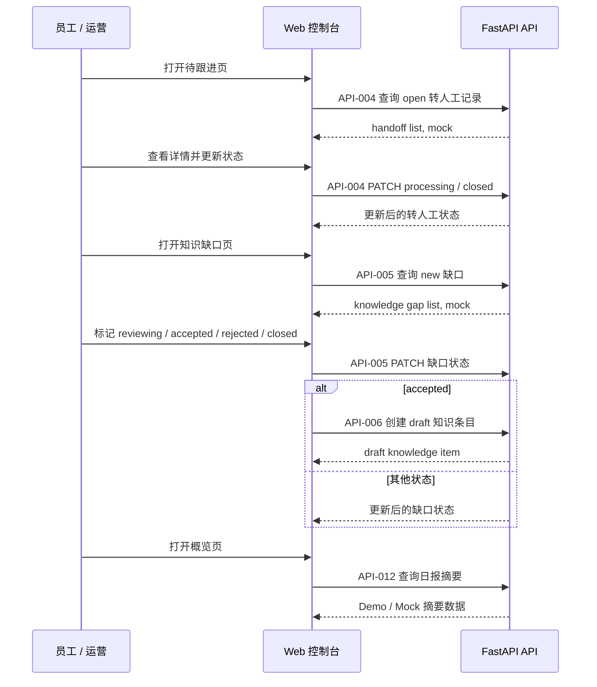

# Web 控制台详细设计

> **定位：详细设计。** 本文细化 Phase1 员工 / 运营 Web 控制台及 Phase2.5 / Phase3A Product Sandbox Console 增量，受 `docs/04-architecture.md`、`docs/07-api-spec.md` 约束；跨入口前端交互、状态、边界文案和验收路径见 `docs/design/frontend-interaction.md`。

## 0. 文档元信息

| 项 | 内容 |
|---|---|
| 设计对象 | 员工 / 运营 Web 控制台 |
| 文档路径 | docs/design/web-console.md |
| 输入来源 | docs/02-srs.md / 03-prd.md / 04-architecture.md / 05-tech-spec.md / 07-api-spec.md / 09-verification.md / docs/design/frontend-interaction.md |
| 覆盖 REQ / NFR | REQ-006、REQ-010、REQ-011、REQ-017、REQ-018、REQ-019、REQ-020、REQ-021、REQ-022 |
| 所属 Phase | [P1] Demo（Phase2 基础权限 / 角色可见性待补） |
| 交付物形态 | Demo / Product Sandbox |
| 当前状态 | P1-已实现；Product Sandbox Console 增量待实现 |
| 最后更新 | 2026-07-15 |
| 下游影响 | docs/08-dev-plan.md（Sprint-4/7）、docs/09-verification.md（TC-006/009/010/011/012）、frontend/console/、tests/ |
| UI 原型策略 | 代码原型（engineering-driven），见 ai/project-rules.md §2.7；跨入口交互见 docs/design/frontend-interaction.md |

## 1. 目标与范围

Web 控制台用于演示员工和运营人员如何查看客户会话、待跟进、高风险事项、知识缺口、Mock 通知和日报摘要。Phase1 不实现生产登录、角色权限、多租户或真实组织架构。

覆盖需求：REQ-006、REQ-007、REQ-008、REQ-009、REQ-010、REQ-011、REQ-012、REQ-014、REQ-016。

## 2. 页面结构

Phase1 控制台采用顶部 Tab 导航；列表详情采用右侧详情栏，不做生产级左侧导航、复杂权限菜单或多租户工作台。

| 页面 | 主要内容 | API |
|---|---|---|
| 概览 | 会话数、转人工数、缺口数、未结案、今日摘要 | API-012 |
| 会话列表 | 会话状态、最近消息、风险等级、场景包 | API-003 |
| 待跟进 | 转人工原因、建议负责人、处理状态 | API-004 |
| 知识缺口 | 问题、标签、状态、处理说明 | API-005、API-006 |
| 知识条目 | 知识条目列表、状态（draft/active/archived）、来源、转正、新增 | API-006 |
| 通知记录 | Mock 通知 payload、状态、关联对象 | API-009 |
| 场景包 | 产品型 / 项目型配置摘要 | API-010、API-011 |
| Mock 数据 | 订单 / 项目 / 售后样例数据 | API-008 |

## 3. 状态与筛选

- 会话筛选：`status`、`scenario_pack_code`、`risk_level`。
- 转人工筛选：`status`、`risk_level`、`suggested_owner`。
- 缺口筛选：`status`、`scenario_pack_code`、`tag`。
- 知识条目筛选：`status`（draft/active/archived）、`scenario_pack_code`、`tag`。
- 通知筛选：`event_type`、`send_status`。

## 4. 关键交互

### 4.1 查看转人工

1. 控制台调用 API-004 查询 `open` 状态。
2. 用户打开详情，查看来源会话、原因、建议负责人。
3. 用户更新状态为 `processing` 或 `closed`。

### 4.2 处理知识缺口

1. 控制台调用 API-005 查询 `new` 状态。
2. 用户标记为 `reviewing`、`accepted`、`rejected` 或 `closed`。
3. 若接受为知识候选，调用 API-006 创建 `draft` 知识条目（自动入库，状态 `draft`，不立即生效）。
4. `draft` 知识条目需在「知识条目」页人工转正为 `active` 后，才会进入问答检索（见 §4.4）。

### 4.3 查看日报摘要

1. 控制台调用 API-012。
2. 展示会话数、自动回答数、转人工数、缺口数、未结案数。
3. 明确标记数据来自 Demo / Mock。

### 4.4 知识条目管理（task-009b/009c）

1. 控制台调用 API-006 `GET /knowledge-items` 查询知识条目列表，支持 `status` / `scenario_pack_code` / `tag` 筛选。
2. 列表展示 `item_id`、`title`、`status`、`source_ref`、`scenario_pack_code`、来源（缺口入库 `origin_gap_id` / 手动新增 / seed）、`updated_at`。
3. 转正：admin 可把 `draft` 条目 `PATCH` 为 `active`（转正后才进入问答检索）；`active` 可归档为 `archived`。
4. 新增：admin 可通过表单 `POST` 一条知识候选（默认 `draft`），需填 `source_ref`。
5. viewer 只读列表，不显示转正 / 新增按钮。

## 5. UI 文案约束

- “Mock 数据”：用于订单 / 项目 / 售后进度和通知。
- “待人工确认”：用于高风险、无依据、投诉、赔付、合同、价格、交期。
- “知识候选”（`draft`）：不能直接称为已生效知识，未进入问答检索。
- “已生效”（`active`）：知识条目已转正，会被问答检索命中。
- “已归档”（`archived`）：已停用，不参与检索。
- “Demo 控制台”：避免用户误解为生产系统。

## 6. 验收

- TC-006、TC-009、TC-010、TC-011、TC-012 通过。
- 控制台能展示并更新转人工和缺口状态。
- 不展示真实组织、真实员工、真实客户隐私。

## 上游依据与追溯

最低追溯链：`REQ/NFR → Phase → COMP/MOD/Flow → Table/Field → API → Design Point → Sprint/Task → TC`。

| 来源 | 章节 / ID | 本设计承接内容 | 下游影响 |
|---|---|---|---|
| docs/02-srs.md / 03-prd.md | REQ-006~012/014/016 | 会话查看、待跟进、缺口处理、通知、日报、场景包、Mock 数据 | 08 / 09 |
| docs/04-architecture.md | COMP-002（Web Console）、COMP-009（Handoff）；MOD-002（frontend/console）+ MOD-003（frontend/shared）；Flow-003（知识缺口）、Flow-004（转人工） | 页面结构、关键交互 | 05 / 07 |
| docs/06-db-design.md | zycs_human_handoffs、zycs_notifications、zycs_conversations、zycs_knowledge_gaps、zycs_daily_summaries | 控制台数据对象 | — |
| docs/07-api-spec.md | API-003 会话列表、API-004 转人工、API-005 缺口、API-006 知识候选、API-008 Mock 数据、API-009 通知、API-010/011 场景包、API-012 日报 | 接口依赖 | 代码 / 测试 |
| docs/08-dev-plan.md | Sprint-4（控制台）、Sprint-7（试点部署 / 权限） | 实现范围 | tasks |
| docs/09-verification.md | TC-006 转人工、TC-009 Mock 通知、TC-010 运营列表、TC-011 缺口、TC-012 日报（09 §3 显式反向引用本文） | 验收入口 | 验收记录 |

错误码（07 §5，按 API 归属推断）：`VALIDATION_ERROR`、`HIGH_RISK_REQUIRES_HANDOFF`、`CONVERSATION_NOT_FOUND`。

## 写操作失败、异常与降级路径

> 注：§4 关键交互 mermaid 当前仅成功路径；以下失败 / 异常 / 降级 / 无权限分支以表格定义补全（消除 happy-path），mermaid 补 alt 失败分支的可视化属 P1。Phase1 控制台写操作后端无鉴权（Demo），Phase2 必须补后端权限边界——前端可见性不得替代后端鉴权。

| 场景 | 触发条件 | 系统行为 | 用户可见信息 | 是否阻塞验收 | 关联 TC |
|---|---|---|---|---|---|
| 转人工更新失败 | API-004 PATCH 404/409/500 | 保留原状态，提示重试 | 状态更新失败 | 否 | TC-006 |
| 转人工记录不存在 | handoff_id 无效（404） | 返回 `CONVERSATION_NOT_FOUND` 类提示 | 记录不存在 | 否 | TC-006 |
| 缺口更新失败 | API-005 PATCH 404/409/500 | 保留原状态，提示重试 | 状态更新失败 | 否 | TC-011 |
| 知识候选创建失败 | API-006 POST 校验失败 / 500 | 不创建，提示重试，不称已生效 | 创建失败 | 否 | TC-011 |
| 高风险强制转人工 | 缺口 / 会话命中高风险 | 不可关闭，返回 `HIGH_RISK_REQUIRES_HANDOFF` | 需人工处理 | 否 | TC-005 |
| 越权写（Phase2） | 无权限操作 | 后端拒绝（Phase1 Demo 无鉴权；Phase2 补） | 无权限提示 | 否（Phase2 才适用） | TC-016 |
| 接口契约错误 | 4xx / 5xx | ErrorState，不暴露堆栈 | 通用错误 | 否 | TC-013 |

## 页面状态覆盖

| 状态 | 触发 | 用户可见文案 | 可操作项 | 恢复 / 重试 | 关联 TC |
|---|---|---|---|---|---|
| loading | 列表加载 / 刷新 | 加载中 | 禁用操作 | 自动 | TC-010 |
| empty | 无数据 / 筛选无结果 | 暂无演示数据 / 筛选无结果 | 调整筛选 | — | TC-010 |
| error | API / 网络失败 | 可理解错误 | 重试 | 重试 | TC-013 |
| disabled | 状态更新中 | 更新中 | 禁用当前按钮 | — | TC-006 / TC-011 |
| success | 更新成功 | 状态已更新 | 继续 | — | TC-006 / TC-011 |
| no-permission | Phase1 无鉴权（Demo）/ Phase2 越权 | Demo 控制台 / 无权限 | — | — | TC-016 |
| degraded | Mock 数据 / 通知 | MockBadge | — | — | TC-008 / TC-009 |
| risk | 高风险待跟进 | 待人工确认 | 转人工 | — | TC-005 |
| readonly | 场景包 / Mock 数据只读 | Phase1 仅查看 | — | — | TC-007 / TC-014 |

## 待人工确认项

| ID | 待确认项 | AI 建议 | 建议依据 | 备选方案 | 取舍影响 / 阻塞关系 |
|---|---|---|---|---|---|
| WC-C-001 | Phase2 后端权限补齐口径 | 控制台写操作（转人工 / 缺口 / 知识候选）后端补角色权限 | project-rules §1 Phase2、07 §6 | 仅前端可见性控制 | 不阻塞 Phase1；阻塞 Phase2 试点放行 |
| WC-C-002 | Mock 数据替换为真实业务数据时点 | Phase3B 接真实系统后 | project-rules §1 | 保持 Mock | 不阻塞 |
| WC-C-003 | 场景包 / Mock 数据是否纳入控制台验收 | 纳入只读查看（TC-007/008/014） | §2 已有对应页面 | 不纳入 | 不阻塞 |
| WC-C-004 | 知识条目 active 进检索的运营可见性 | active 条目标注「已生效·问答可命中」 | task-009c active 进检索已实现；用户确认 2026-07-11 | 仅标状态 | 不阻塞 |

## Product Sandbox Console 增量（Phase2.5 / Phase3A，2026-07-15）

| 区域 | 增量交互 | 边界 |
|---|---|---|
| 顶部 / 概览 | 显示当前 `source_mode`、`scenario_pack`、`mock/real` 和真实数据门禁状态。 | 默认 `demo_sandbox`，真实数据 No-Go 不得伪装为已接入。 |
| 场景包详情 | 展示 Demo Dataset、虚拟客户资料包、数据版本和 seed 来源。 | 不展示真实客户隐私或真实凭据。 |
| 运营配置 | 提供数据源模式查看 / 切换入口；真实模式只显示门禁状态。 | 未授权不调用真实系统。 |
| Demo reset | 对当前场景包执行 reset，展示确认提示和结果。 | 不影响其他场景包或真实配置。 |
| 详情栏 | 所有会话、Mock 业务、通知、摘要展示 `source_ref`。 | 来源缺失时不得标记验收通过。 |

关联验收：TC-066~TC-071。
