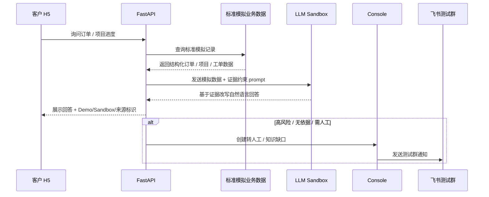

# Demo Sandbox Readiness Evaluation（标准模拟数据 + 飞书测试群 + LLM Sandbox）

## 0. 文档元信息

| 项 | 内容 |
|---|---|
| 项目 | 知衍数字客服统一平台 |
| 评估日期 | 2026-07-11 |
| 评估对象 | 客户演示用 Demo Sandbox：标准化模拟业务数据、真实飞书测试群、真实 LLM API（仅处理模拟数据） |
| 评估类型 | 阶段内口径重评估；不接真实 CRM / ERP / OA / 工单系统 |
| 评估结论 | Conditional Go：可进入 Demo Sandbox 实现；真实业务系统仍 No-Go；LLM 仅限模拟数据与证据约束回答 |
| 触发原因 | 用户确认当前暂无真实客户数据，但需要更贴近真实系统的数据规范和可演示外部能力 |

## 1. 背景与调整点

此前 Phase3 评估将“真实系统接入”和“LLM 真实启用”整体保持 No-Go / Blocked，原因是缺少试点客户接口授权、真实数据边界、安全评审和生产系统验收场景。

本次用户补充了新的演示前提：

- 暂时不能接真实 CRM / ERP / OA / 工单系统。
- 客户演示仍需要看起来像未来真实接入后的效果。
- 模拟数据应尽量按规范数据生成，而不是随意样例。
- 飞书测试群是真实可接的外部触达渠道。
- LLM 可以接入，但输入只来自模拟数据，不含真实客户隐私或生产业务数据。

因此需要把口径细分为：真实业务系统继续 No-Go；Demo Sandbox 能力可推进。

## 2. 新 Go / No-Go 结论

| 能力 | 新结论 | 说明 | 必要边界 |
|---|---|---|---|
| 真实 CRM / ERP / OA / 工单接入 | No-Go | 仍缺客户接口、授权、沙箱账号、字段映射和安全评审 | 不调用真实生产接口 |
| 标准化模拟业务数据 | Go | 可按真实系统字段规范生成订单 / 项目 / 工单 / 客户 / 进度节点数据 | 必须标识 Mock / Demo，不冒充真实数据 |
| 飞书测试群出站通知 | Go | RG-001 已验证沙箱实发；可用于客户演示真实触达链路 | 仅测试群 / sandbox，不接生产组织数据 |
| LLM Sandbox | Conditional Go | 可接真实 LLM API，但只处理模拟数据和知识库证据 | 默认关闭；需显式配置；不得写入 key；不得无依据编造 |
| LLM 生产自动答复 | No-Go | 一旦接真实客户数据需重新评估 | 需安全、成本、证据、兜底和授权 |
| 飞书事件回调 / 生产群 | No-Go | 当前只允许出站测试群 | 回调另行评估 |

## 3. Demo Sandbox 目标体验

客户演示应呈现“未来真实接入后的样子”，但每个环节都明确 Demo / Mock / Sandbox 标识。

建议演示链路：

1. H5 输入标准订单号 / 项目号。
2. 后端查标准模拟数据。
3. LLM Sandbox 只根据模拟数据生成自然语言说明。
4. H5 展示“依据：Demo 模拟业务数据 + LLM Sandbox”。
5. 高风险问题仍强制转人工。
6. 转人工 / 缺口通知真实发送到飞书测试群。
7. Console 展示会话、缺口、知识条目、通知和模拟业务数据。

## 4. 标准化模拟数据要求

模拟数据要按未来真实系统的“最小可迁移字段”生成，而不是散落硬编码。

| 对象 | 必需字段 | 建议字段 | 禁止内容 |
|---|---|---|---|
| 客户 | `customer_id`、`customer_type`、`display_name`、`mock=true` | 行业、地区、客户等级 | 真实手机号、真实地址、真实联系人 |
| 订单 | `order_id`、`external_ref`、`status`、`stage`、`source_ref`、`mock=true` | 预计交付、生产节点、质检状态 | 真实合同金额、真实报价、真实客户隐私 |
| 项目 | `project_id`、`external_ref`、`phase`、`milestones`、`source_ref`、`mock=true` | 下一步、风险提示、更新时间 | 未确认承诺、内部成本、真实人员隐私 |
| 工单 | `ticket_id`、`external_ref`、`status`、`category`、`source_ref`、`mock=true` | 处理节点、建议负责人角色 | 赔付裁决、内部敏感备注 |
| 进度节点 | `node_id`、`name`、`status`、`updated_at` | owner_role、evidence_ref | 真实员工姓名 / 联系方式 |

数据生成原则：

- 编号稳定可复现，例如 `DEMO-ORDER-202607-001`、`DEMO-PROJ-202607-001`。
- 每条记录带 `source_ref`，例如 `demo_erp:order:DEMO-ORDER-202607-001`。
- 每条记录带 `mock: true` 或 `environment: demo_sandbox`。
- 状态值尽量靠近真实系统：`pending_material`、`in_production`、`quality_check`、`ready_to_ship`、`delivered`。
- 高风险字段不生成，或只生成“需人工确认”的占位。

## 5. LLM Sandbox 边界

LLM 可以进入 Demo Sandbox，但必须作为“证据改写器 / 话术生成器”，不是事实来源。

### 5.1 允许

- 输入标准模拟业务数据、已审核知识条目、规则命中结果。
- 将结构化模拟记录改写成客户可读回答。
- 生成“下一步建议 / 需要人工确认”的温和话术。
- 在无依据时输出兜底话术，不补业务事实。

### 5.2 禁止

- 把 LLM 输出当作业务事实来源。
- 让 LLM 猜订单进度、交期、赔付、报价、合同条款。
- 将 API key、prompt、客户隐私、真实合同 / 订单 / 联系方式写入仓库或日志。
- 在未明确来源时回答“已查到真实系统”。

### 5.3 建议配置

| 配置 | 取值 | 说明 |
|---|---|---|
| `ZYCS_LLM_MODE` | `disabled` / `mock` / `sandbox` | 默认 `disabled`；演示显式设 `sandbox` |
| `ZYCS_LLM_PROVIDER` | `openai` / `compatible` / TBD | 不在仓库写真实 provider key |
| `ZYCS_LLM_TIMEOUT_SECONDS` | 5~15 | 超时转 Mock / 规则兜底 |
| `ZYCS_LLM_MAX_INPUT_CHARS` | TBD | 防止 prompt 过大 |
| `ZYCS_LLM_DEMO_ONLY` | `true` | 明确仅演示模拟数据 |

### 5.4 验收口径

- LLM 输入只包含模拟数据和知识证据。
- 响应必须带 `answer_type=llm_sandbox` 或等价标识。
- 响应必须保留 `source_ref` / evidence 列表。
- 超时 / 失败时不影响主链路，回退规则回答或转人工。
- 高风险问题不调用 LLM 自动给结论，仍转人工。

## 6. 飞书测试群边界

飞书测试群已通过 RG-001 沙箱实发验证，可作为 Demo Sandbox 的真实外部触达能力。

允许：

- 发送转人工通知。
- 发送知识缺口通知。
- 发送 Demo 演示摘要。
- payload 标注 `notify_mode=sandbox`、`mock=false`（通知通道真实）、业务数据标注 `mock=true`（业务内容模拟）。

禁止：

- 接生产组织通讯录、真实生产群、事件回调。
- 发送真实客户隐私、合同、订单、报价、联系方式。
- 把测试群实发包装成生产飞书集成已完成。

## 7. 建议实现任务拆分

| 优先级 | 任务 | 范围 | 验收 |
|---|---|---|---|
| P0 | 标准模拟数据包 | 生成客户 / 订单 / 项目 / 工单 / 进度节点规范数据 | Console / H5 可查，字段稳定，均标 Mock |
| P0 | LLM Sandbox 适配器 | `disabled` 默认，`sandbox` 显式启用；只读模拟数据 | 有依据回答、无依据不编造、高风险转人工 |
| P0 | Demo 演示脚本 | 标准提问、预期回答、飞书通知路径 | 可按脚本完整演示 |
| P1 | Console 演示增强 | 展示 Demo/Sandbox 来源、LLM Sandbox 标识 | 客户能区分模拟数据和真实测试群 |
| P1 | 飞书测试群演示链路 | 将转人工 / 缺口纳入演示脚本 | 测试群收到通知，业务内容仍标 Mock |

## 8. 风险与缓解

| 风险 | 影响 | 缓解 |
|---|---|---|
| 客户误以为已接真实系统 | 商务 / 交付误解 | UI、回答、手册都标 Demo / Mock / Sandbox |
| LLM 编造进度或承诺 | 可信度风险 | LLM 只改写证据；无依据转人工；高风险禁用自动结论 |
| 凭据泄露 | 安全风险 | key 只走环境变量；日志和文档不记录凭据 |
| 飞书测试群混入真实信息 | 隐私风险 | 演示只发送模拟业务数据；群名 / 文案标测试 |
| 模拟数据不规范 | 未来迁移成本高 | 按真实接口问卷中的字段结构生成，保留 `source_ref` |

## 9. 对现有结论的修正关系

本评估不推翻 Phase3 真实系统 No-Go，而是新增 Demo Sandbox 例外口径：

- `docs/research/2026-07-11-phase3-upgrade-evaluation.md`：真实 CRM / ERP / OA / 工单 No-Go 仍成立。
- `docs/research/2026-07-11-phase3-security-data-boundary-review.md`：真实数据 / 真实生产系统 / 生产 LLM 自动答复 No-Go 仍成立。
- `docs/research/2026-07-11-tech-env-evaluation-llm.md`：RG-003 Conditional Go 可细化为“LLM Sandbox 可演示，真实生产启用仍阻塞”。
- `docs/research/2026-07-10-tech-env-evaluation-feishu-sandbox.md`：飞书出站测试群 Go 可纳入 Demo Sandbox 主链路。

## 10. 待人工确认项

| ID | 待确认项 | AI 建议 | 建议依据 | 备选方案 | 取舍影响 / 阻塞关系 |
|---|---|---|---|---|---|
| DS-C-001 | 是否接受 Demo Sandbox 口径 | 接受：真实系统 No-Go，标准模拟数据 + 飞书测试群 + LLM Sandbox Conditional Go | 用户明确需要客户演示且暂无真实客户数据 | 维持全部 No-Go | 无法展示 LLM 和真实通知价值 |
| DS-C-002 | LLM 是否可接真实 API | 可接 sandbox，但只处理模拟数据 | 无真实客户数据，风险可控；仍需 key 安全与不编造约束 | 继续 Mock LLM | 演示效果较弱 |
| DS-C-003 | 首个实现顺序 | 先标准模拟数据包，再 LLM Sandbox，再演示脚本 | LLM 需要稳定证据输入 | 先接 LLM | 容易变成无依据聊天 |
| DS-C-004 | 飞书测试群是否纳入演示主链路 | 纳入 | RG-001 已 Go，真实触达体验强 | 仅 Console 展示通知记录 | 客户感知较弱 |

## 11. 建议下一步

1. 回写 `docs/05-tech-spec.md` / `docs/08-dev-plan.md` / `docs/09-verification.md`，明确 Demo Sandbox 口径。
2. 新建任务单：标准模拟业务数据包（优先）。
3. 新建任务单：LLM Sandbox 适配器（默认关闭，显式启用）。
4. 新建 / 更新演示手册：客户演示脚本 + 飞书测试群注意事项。

